# Sobre

Neste desafio temos como objetivo principal normalizar uma tabela do banco de dados concessionaria e desenhar o modelo relacional e dimensional dessa tabela já normalizada.


# Instruções, como foi realizado de fato o desafio.

#### Bom antes de tudo vou deixar abaixo como a tabela estava e vou falar sobre o que eu realizei para normaliza-la.

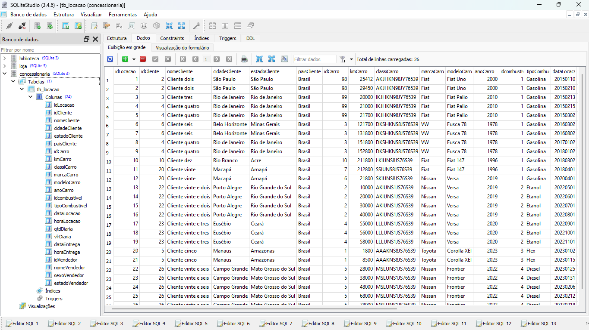

Como você pode ver é uma tabela unica com todas as colunas, eu optei pra evitar ter possiveis conflitos criar uma DB com o nome concessionaria e alterei o nome da que foi nos dada pra concessionaria2. E ai mais pra frente vocês verão que na hora de inserir eu transferi os dados do BD antigo pro novo normalizado.


### Primeiras mudanças (Normalização)

Eu decidi separar em 6 tabelas: *`Clientes`*, *`Vendedor`*, *`Combustivel`*, *`Carros`*, *`DatasLocacao`* e *`Locacoes`*

##### Clientes

Na criação da tabela *`Clientes`* eu peguei as colunas idCliente, nomeCliente, cidadeCliente, estadoCliente e paisCliente da tabela *`tb_locacao`*.

``` bash
CREATE TABLE Clientes (
    idCliente INT PRIMARY KEY,
    nomeCliente VARCHAR(100) not null,
    cidadeCliente VARCHAR(50) not null,
    estadoCliente VARCHAR(50) not null,
    paisCliente VARCHAR(50) not null
);

```

Resultado:

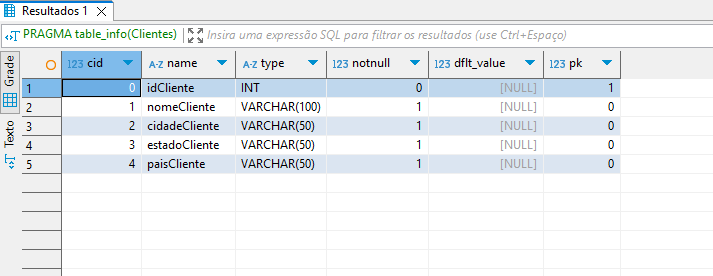
<br>


<br>

##### Vendedor

Já em *`Vendedor`* eu separei as colunas IdVendedor, nomeVendedor, sexoVendedor e estadoVendedor da *`tb_locacao`*.


``` bash
CREATE TABLE Vendedor (
    idVendedor INT PRIMARY KEY,
    nomeVendedor VARCHAR(100) not null,
    sexoVendedor smallint not null,
    estadoVendedor VARCHAR(50) not null
);
```

Resultado:

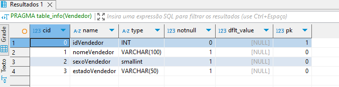
<br>

##### Combustivel

Na tabela *`Combustivel`*, separei as duas colunas relacionadas a ela que são IdCombustivel e tipoCombustivel que em *`tb_locacao`*

``` bash
CREATE TABLE Combustivel (
    idCombustivel INT PRIMARY KEY,
    tipoCombustivel VARCHAR(50) not null
);
```
Resultado:

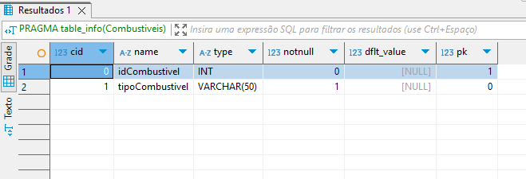

#### Carros

Nessa tabela *`Carros`* eu utilizei as colunas idCarro, kmCarro, classiCarro, marcaCarro, modeloCarro e anoCarro de *`tb_locacao`*. Fora que adicionei a chave estrangeira idCombustivel para garantir que apareça nesta tabela o combustivel que o carro utiliza.

``` bash
CREATE TABLE Carros (
    idCarro INT PRIMARY KEY,
    marcaCarro VARCHAR(50) not null,
    modeloCarro VARCHAR(50) not null,
    anoCarro INT not null,
    kmCarro INT not null,
    classiCarro VARCHAR(50) not null,
    idCombustivel INT,
    FOREIGN KEY (idCombustivel) REFERENCES Combustivel(idCombustivel)
);

```

Resultado:

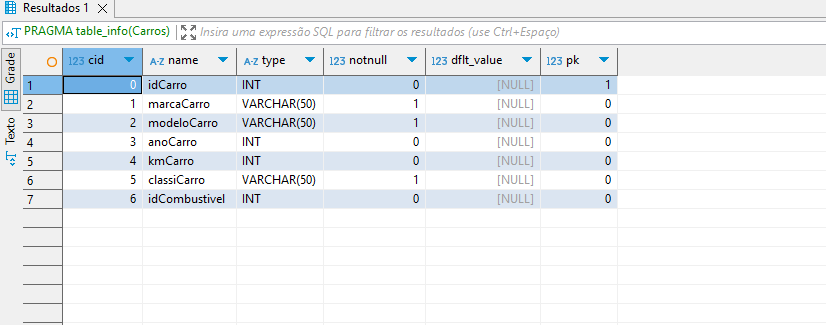
<br>

#### DatasLocacao

Também criei a tabela DatasLocacao, utilizando as colunas dataLocacao, horaLocacao, dataEntrega e horaEntrega da tabela tb_locacao. Além disso, adicionei uma nova coluna chamada id_data, que atua como chave primária para identificar de forma única cada registro na tabela.

``` bash
CREATE TABLE DatasLocacao (
    id_data INT PRIMARY KEY,  
    dataLocacao DATE,               
    horaLocacao TIME,            
    dataEntrega DATE,                
    horaEntrega TIME                 
);
```

Resultado:

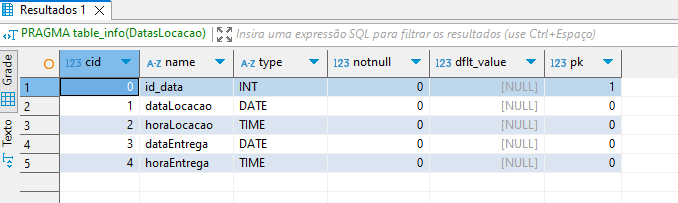
<br>

#### Locacoes

Na tabela *`Locacoes`*, foram utilizadas as colunas idLocacao, idCliente, idCarro, idVendedor, id_data, qtdDiaria e vlrDiaria, todas provenientes da tabela *`tb_locacoes`*. Essa tabela foi feita para consolidar as informações das locações realizadas, conectando dados de clientes, carros, vendedores e datas. Para garantir a integridade referencial, foram adicionadas chaves estrangeiras relacionadas às tabelas *`Clientes, Carros, Vendedor`* e *`DatasLocacao`*.

``` bash
CREATE TABLE Locacoes (
    idLocacao INT PRIMARY KEY,
    idCliente INT,
    idCarro INT,
    idVendedor INT,
    id_data INT, 
    qtdDiaria INT,
    vlrDiaria DECIMAL(10, 2),
    FOREIGN KEY (idCliente) REFERENCES Clientes(idCliente),
    FOREIGN KEY (idCarro) REFERENCES Carros(idCarro),
    FOREIGN KEY (idVendedor) REFERENCES Vendedor(idVendedor),
    FOREIGN KEY (id_data) REFERENCES DatasLocacao(id_data) 
);
```

Resultado:

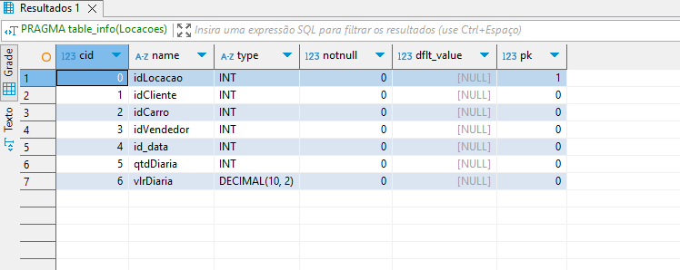
<br>

### Inserção de dados da tabela Tb_locacoes para as já normalizadas 

Bom nessa parte inserção como eu criei um DB novo eu transferi as informações da tabela unica no DB antigo pro novo, abaixo vou deixar como ficou os códigos. Caso haja uma modificação brusca também irei comentar.


#### Clientes

Inserindo os dados da tabela `tb_locacoes` do DB antigo `concessionaria2` na tabela `Clientes` no DB novo `concessionaria`.

``` bash
INSERT INTO Clientes (idCliente, nomeCliente, cidadeCliente, estadoCliente, paisCliente)
SELECT DISTINCT idCliente, nomeCliente, cidadeCliente, estadoCliente, paisCliente
FROM concessionaria2.tb_locacao;
``` 

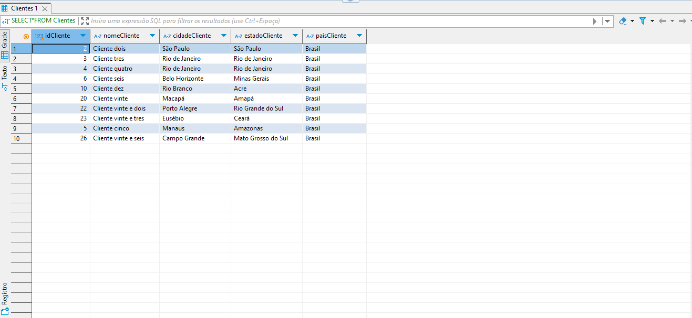
<br>

#### Vendedor

Basicamente fiz a mesma coisa doq fiz acima eu so esqueci de comentar que to usando distinct em ambos pra evitar duplicatadas. Mas num geral em ambos fiz a mesma coisa.

``` bash 
insert into Vendedores (idVendedor, nomeVendedor, sexoVendedor, estadoVendedor)
select distinct idVendedor, nomeVendedor, sexoVendedor, estadoVendedor
From concessionaria2.tb_locacao;
```

Resultado:

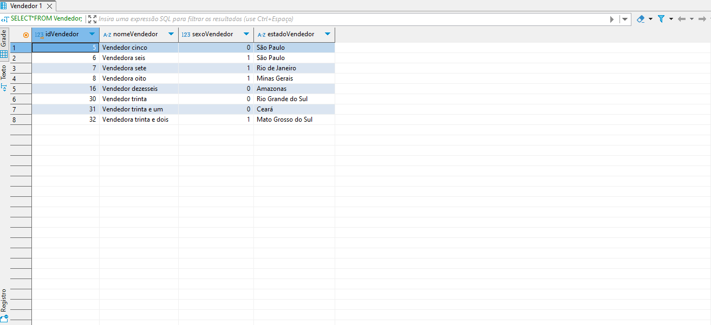
<br>

#### Combustiveis

Pra evitar ser repetitiva vou so dizer que este está seguindo o padrão dos dois ultimos na inserção de dados.

``` bash
INSERT INTO Combustiveis (idCombustivel, tipoCombustivel)
SELECT DISTINCT idcombustivel, tipoCombustivel
From concessionaria2.tb_locacao;
```

Resultado:

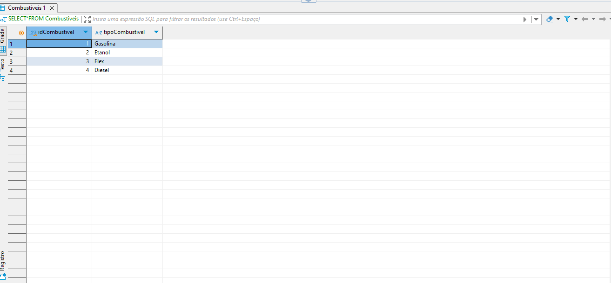
<br>

#### Carros

No código abaixo, eu estava tendo um problema que consistia em ele informar que alguns valores de idCarro já existiam na tabela Carros e, quando íamos checar, não haviam. Após pesquisas, decidi usar INSERT OR IGNORE para resolver isso. Esse comando ignora as tentativas de inserir dados duplicados, permitindo que apenas os registros novos fossem adicionados sem gerar erros.

``` bash 
insert or ignore into Carros (idCarro, marcaCarro, modeloCarro, anoCarro, kmCarro, classiCarro,idCombustivel)
select distinct idCarro, marcaCarro, modeloCarro, anoCarro, kmCarro, classiCarro, idcombustivel
From concessionaria2.tb_locacao;
```

Resultado:

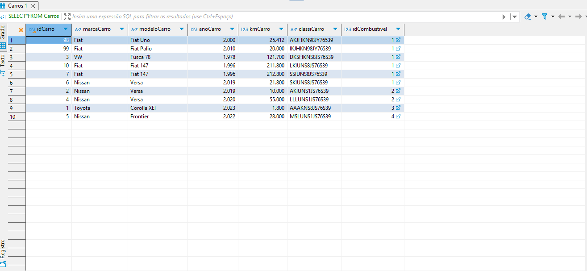
<br>


#### DatasLocacao

Para inserir os dados na tabela `DatasLocacao`, usei o código abaixo. A dificuldade que tive nele foi que as datas e horas na tabela concessionaria2.tb_locacao estavam em formatos diferentes do padrão ISO (YYYY-MM-DD para datas e HH:MM para horas). Resolvi isso manipulando as strings para padronizar os valores usando funções como substr para separar partes das datas e horas, e combiná-las no formato correto. 


``` bash
INSERT INTO DatasLocacao (id_data, dataLocacao, horaLocacao, dataEntrega, horaEntrega)
SELECT 
    idLocacao AS id_data,
    DATE(
        substr(dataLocacao, 1, 4) || '-' ||   -- Ano
        substr(dataLocacao, 5, 2) || '-' ||   -- Mês
        substr(dataLocacao, 7, 2)             -- Dia
    ) AS dataLocacao,
    TIME(
        printf('%02d:%02d', 
            CAST(substr(horaLocacao, 1, instr(horaLocacao, ':')-1) AS INTEGER), 
            CAST(substr(horaLocacao, instr(horaLocacao, ':')+1) AS INTEGER)
        )
    ) AS horaLocacao,
    DATE(
        substr(dataEntrega, 1, 4) || '-' ||   -- Ano
        substr(dataEntrega, 5, 2) || '-' ||   -- Mês
        substr(dataEntrega, 7, 2)             -- Dia
    ) AS dataEntrega,
    TIME(
        printf('%02d:%02d', 
            CAST(substr(horaEntrega, 1, instr(horaEntrega, ':')-1) AS INTEGER), 
            CAST(substr(horaEntrega, instr(horaEntrega, ':')+1) AS INTEGER)
        )
    ) AS horaEntrega
FROM concessionaria2.tb_locacao;
```

Resultado:

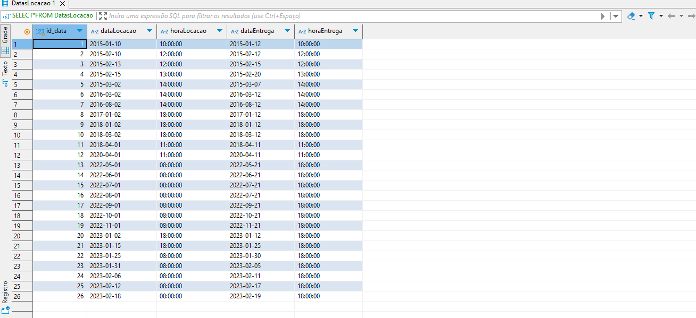
<br>


#### Locacao

Para inserir os dados na tabela `Locacoes`, usei o código abaixo. Aqui, os valores são transferidos diretamente da tabela concessionaria2.tb_locacao, com idLocacao sendo usado tanto como identificador da locação quanto como referência para a coluna id_data. Essa abordagem foi simples porque os dados já estavam no formato correto, então não foi necessário realizar manipulações antes da inserção.

``` bash
INSERT INTO Locacoes (
    idLocacao, 
    idCliente, 
    idCarro, 
    idVendedor, 
    id_data, 
    qtdDiaria, 
    vlrDiaria
)
SELECT 
    idLocacao,  
    idCliente,
    idCarro,
    idVendedor,
    idLocacao AS id_data,  
    qtdDiaria,
    vlrDiaria
FROM 
    concessionaria2.tb_locacao;
```

Resultado: 

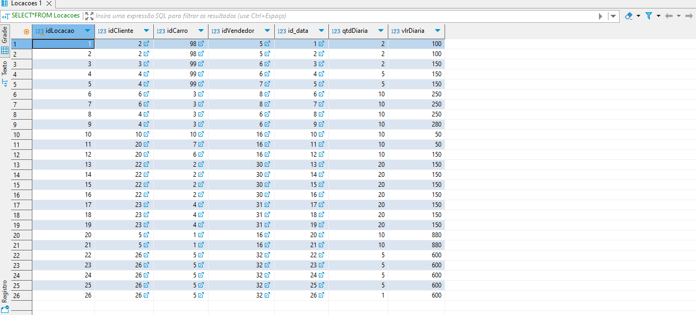
<br>


### Criando as tabelas Dimensionais através do view


#### Clientes

A view `Dim_Clientes` cria uma versão simplificada das informações dos clientes, trazendo dados como o código do cliente, nome, cidade, estado e país. Isso facilita a análise das informações de clientes de forma organizada.

``` bash
CREATE VIEW Dim_Clientes AS
SELECT Distinct
    idCliente AS Codigo,
    nomeCliente AS Cliente,
    cidadeCliente AS Cidade,
    estadoCliente AS Estado,
    paisCliente AS Pais
FROM Clientes;
```

Resultado:

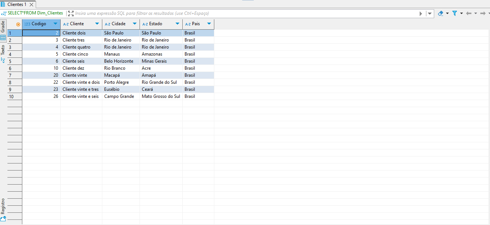
<br>

#### Vendedor

Essa view abaixo, reúne os dados dos vendedores, incluindo o código (idVendedor), nome, estado e o gênero do vendedor. O gênero é determinado através de uma lógica condicional: se o valor de sexoVendedor for 0, é considerado 'Masculino'; se for 1, é 'Feminino'; e se for outro valor, é marcado como 'Outro'. Esse uso do CASE permite adaptar os dados para uma visualização mais clara.

``` bash
CREATE VIEW Dim_Vendedor AS
SELECT 
    idVendedor AS Codigo,
    nomeVendedor AS Vendedor,
    CASE sexoVendedor
        WHEN 0 THEN 'Masculino'
        WHEN 1 THEN 'Feminino'
        ELSE 'Outro'
    END AS Genero,
    estadoVendedor AS Estado
FROM Vendedor;
```

Resultado:

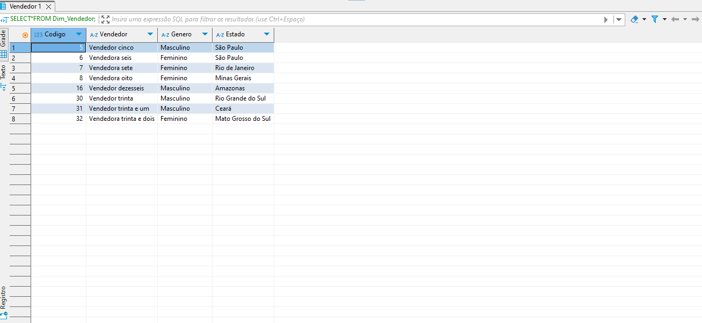
<br>


#### Carro

A `view Dim_Carros` organiza as informações dos carros, trazendo dados como código, marca, modelo, ano, quilometragem, classificação e o tipo de combustível. O tipo de combustível é obtido através de uma subconsulta, buscando o tipo correspondente na tabela Combustiveis. Essa estrutura ajuda a ver os carros de forma consolidada e detalhada.

``` bash
CREATE VIEW Dim_Carros AS
SELECT 
    idCarro AS Codigo,
    marcaCarro AS Marca,
    modeloCarro AS Modelo,
    anoCarro AS Ano,
    kmCarro AS Quilometragem,
    classiCarro AS Classi,
    (SELECT tipoCombustivel 
     FROM Combustiveis 
     WHERE Combustiveis.idCombustivel = Carros.idCombustivel) AS TipoCombustivel
FROM Carros;
```


Resultado:

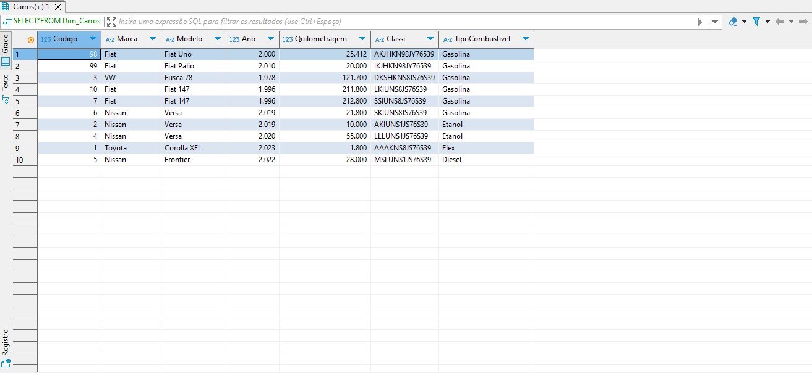
<br>


#### Datas e Horas

A `view Dim_Datas` organiza as informações de datas e horas das locações e entregas. Além das datas e horas, ela também gera colunas adicionais, como ano, mês, dia e até o dia da semana, o que facilita a análise de dados no tempo.

``` bash
CREATE VIEW Dim_Datas AS
SELECT 
    id_data AS id_data,
    dataLocacao AS data_locacao,
    strftime('%Y', dataLocacao) AS ano_locacao,
    strftime('%m', dataLocacao) AS mes_locacao,
    strftime('%d', dataLocacao) AS dia_locacao,
    strftime('%w', dataLocacao) AS dia_semana_locacao,
    horaLocacao AS hora_locacao,
    dataEntrega AS data_entrega,
    strftime('%Y', dataEntrega) AS ano_entrega,
    strftime('%m', dataEntrega) AS mes_entrega,
    strftime('%d', dataEntrega) AS dia_entrega,
    strftime('%w', dataEntrega) AS dia_semana_entrega,
    horaEntrega AS hora_entrega
FROM DatasLocacao;
```

Resultado:

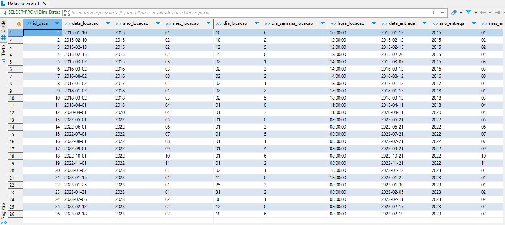
<br>


#### Locacoes

E por fim, a `view Fato_Locacoes` centraliza todos os dados relacionados às locações. Ela inclui os códigos das outras views (como cliente, vendedor, carro e data), além de dados importantes como a quantidade de diárias, o valor por diária e o valor total (calculado multiplicando as diárias pelo valor diário). Essa view é a base para analisar as transações de locação.

``` bash
CREATE VIEW Fato_Locacoes AS
SELECT 
    L.idLocacao AS Codigo_Locacao,
    L.idCliente AS Codigo_Cliente,
    L.idVendedor AS Codigo_Vendedor,
    L.idCarro AS Codigo_Carro,
    L.id_data AS Codigo_Data,
    L.qtdDiaria AS Quantidade_Diarias,
    L.vlrDiaria AS Valor_Diaria,
    (L.qtdDiaria * L.vlrDiaria) AS Valor_Total
FROM 
    Locacoes L;
```

Resultado:

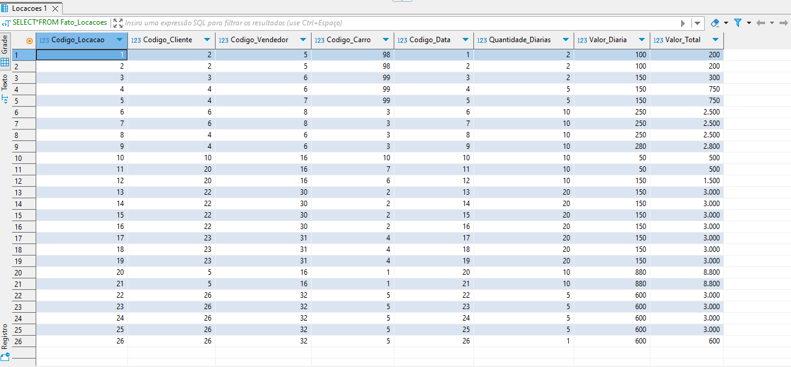
<br>


## Modelo relacional 

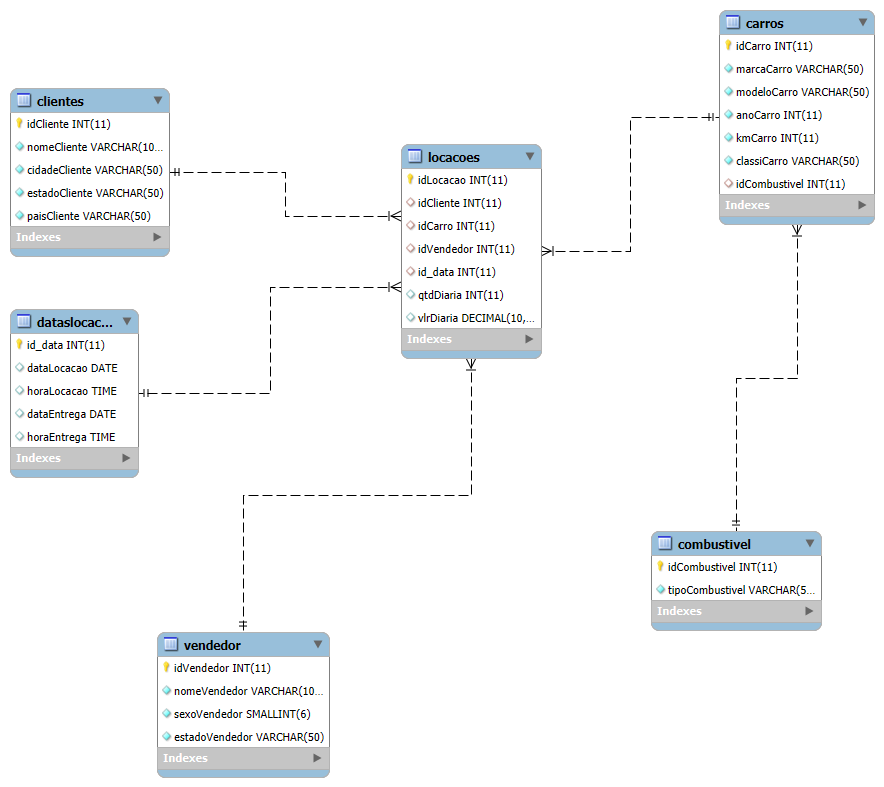
<br>


## Modelo Dimensional

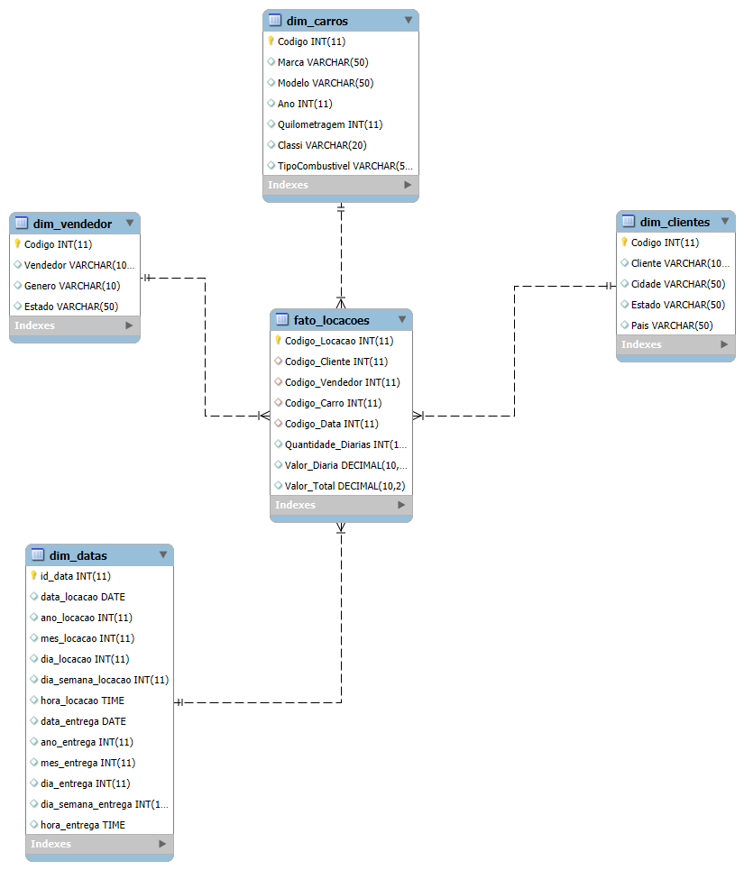