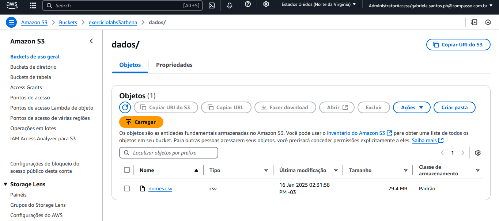
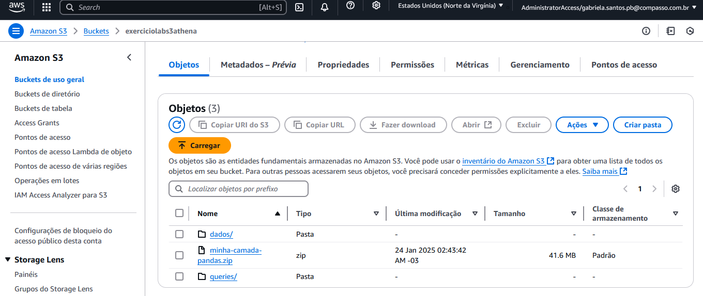
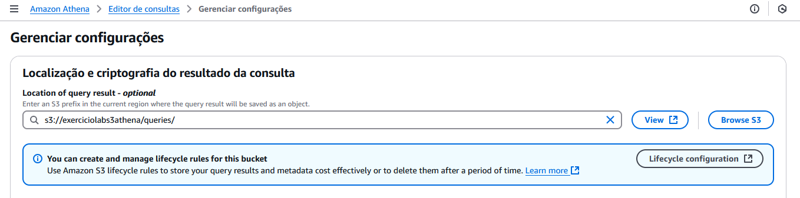
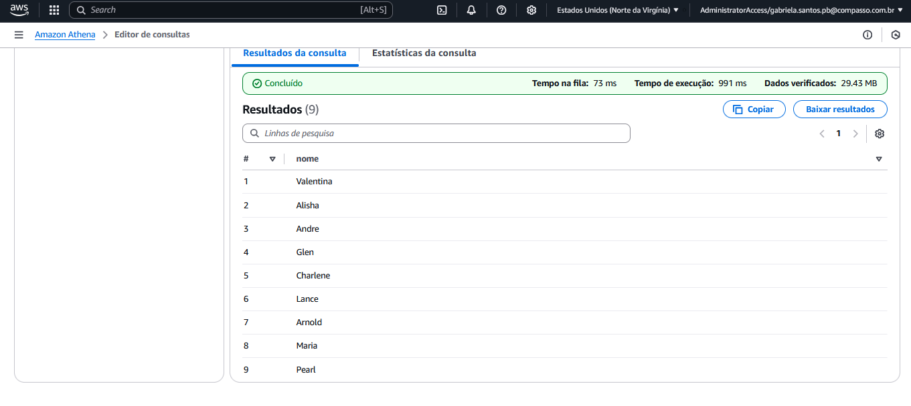
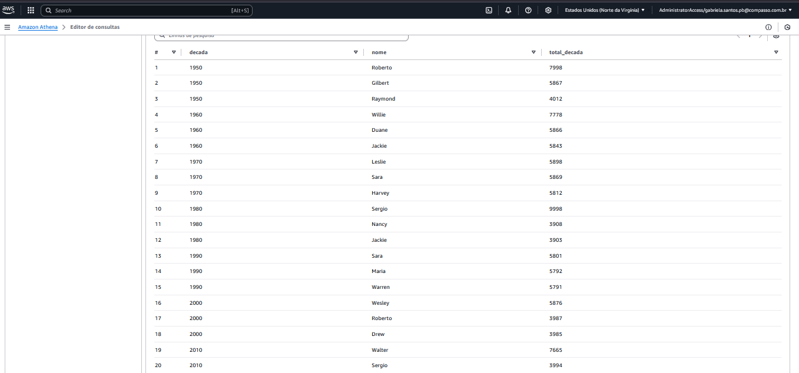

# Exercicio Athena

### Objetivo do exercicio

O objetivo deste exercício foi configurar o AWS Athena para consultas de dados em um arquivo armazenado no S3. Para isso, realizamos as etapas de criação do bucket, upload do arquivo `nomes.csv`, configuração do ambiente no Athena, criação de um banco de dados, criação de uma tabela e execução de consultas SQL para analisar os dados.

## 1.0 Criação do Bucket

Primeiramente, acessei o console da AWS e procurei pelo serviço S3. Para criar o bucket, cliquei em **Create bucket** (Criar bucket). Em seguida, inseri o nome do bucket como `exerciciolabs3athena`, selecionei a região `us-east-1` e aceitei as configurações padrão. Após criado, o bucket ficou como mostrado na imagem abaixo.

## 1.1 Upload do Arquivo nomes.csv

Realizei o download do arquivo `nomes.csv` fornecido e fiz o upload para a pasta `dados` que criei dentro do bucket. Para isso, arrastei e soltei o arquivo no bucket, confirmando o upload ao clicar em **Upload**. 

resultado: 



## 1.2 Configuração no AWS Athena

Após o upload do arquivo no S3, acessei o console do AWS Athena. Antes de realizar consultas, foi necessário configurar a localização dos resultados das consultas no S3, garantindo que elas fossem armazenadas em um local definido no bucket. Primeiramente, criei uma pasta dentro do bucket chamada `queries`.



 Essa pasta será usada exclusivamente pelo Athena para armazenar os resultados das consultas. Em seguida, no console do Athena, configurei o local para os resultados das consultas. No console do Athena, cliquei em **Settings** (Configurações), adicionei o caminho na seção de localização dos resultados e salvei as alterações.

 resultado:

 

## 2.0 Criação do Banco de Dados e da Tabela

Para criar o banco de dados, executei o comando SQL no console do Athena:

```sql

CREATE DATABASE meu banco;

```


Para criar a tabela e mapear os dados do arquivo nomes.csv, utilizei o seguinte comando SQL:

```sql
CREATE EXTERNAL TABLE IF NOT EXISTS meubanco.nomes ( nome STRING, sexo STRING, ano INT, total INT
)
ROW FORMAT SERDE 'org.apache.hadoop.hive.serde2.lazy.LazySimpleSerDe'
WITH SERDEPROPERTIES ( 'serialization.format' = ',', 'field.delim' = ','
)
LOCATION 's3://exerciciolabs3athena/queries/'
```

## 2.1 Testando a Importação e Consultas no Athena

Para testar os dados, executei a seguinte consulta, substituindo o nome dos campos, banco de dados e tabela pelos valores que criei:

```sql
SELECT nome 
FROM meubanco.nomes 
WHERE ano = 1999 
ORDER BY total DESC 
LIMIT 15;
```

Essa consulta irá retornar os 15 nomes mais populares de 1999, ordenados pela quantidade total.

Resultado: 



## 2.2 Consulta dos 3 Nomes Mais Usados em Cada Década

A seguir, como o solicitado, executei a consulta para listar os 3 nomes mais usados em cada década, desde 1950 até 2025:

```sql
WITH nomes_por_decada AS (
  SELECT 
    nome,
    FLOOR(ano / 10) * 10 AS decada,
    SUM(total) AS total_decada
  FROM meubanco.nomes
  WHERE ano BETWEEN 1950 AND 2025
  GROUP BY nome, FLOOR(ano / 10) * 10
)
SELECT 
  decada,
  nome,
  total_decada
FROM (
  SELECT 
    decada,
    nome,
    total_decada,
    ROW_NUMBER() OVER (PARTITION BY decada ORDER BY total_decada DESC) AS rank
  FROM nomes_por_decada
) AS ranked
WHERE rank <= 3
ORDER BY decada, rank;

```

Resultado:



