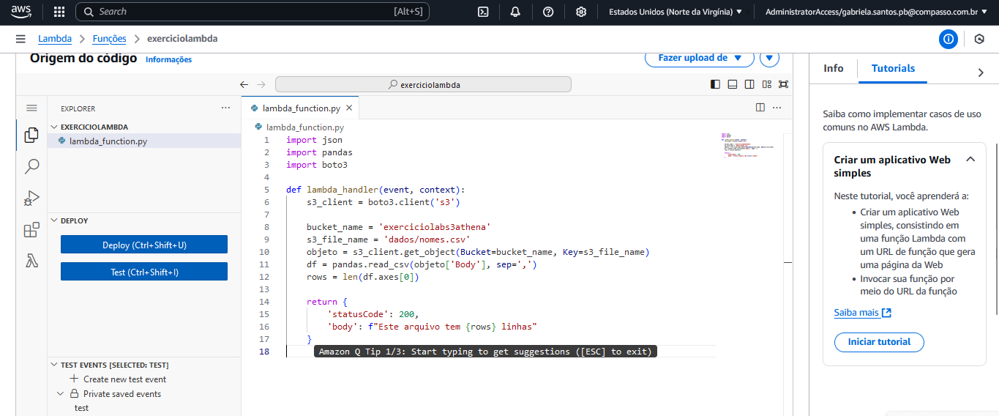
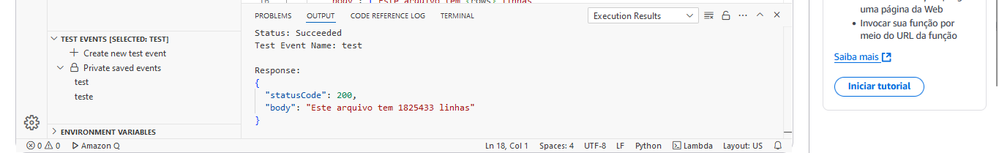

# Configuração do AWS Lambda com Pandas e S3

## Objetivo

Configurar uma função AWS Lambda que utiliza as bibliotecas Pandas para processar um arquivo armazenado no S3. Devido à ausência dessa biblioteca no ambiente padrão do Lambda, será necessário criar uma Layer.

---

## 1.0 Criação da Função do Lambda

Primeiramente, acessei o console do AWS Lambda e selecionei a opção **Criar uma função**. Se o console mostrar uma página inicial, cliquei diretamente em **Criar uma função**.  
Em seguida, selecionei **Author from scratch** (criar do zero) como instruído. No campo **Function name** (nome da função), inseri `exerciciolambda` como nome da função e escolhi **Python 3.9** como runtime. Por fim, cliquei em **Criar** para finalizar a criação da função.

---

## 2.0 Construção do Código

Após criar a função, fui redirecionada para o editor de funções do console do Lambda. O arquivo padrão `lambda_function.py` foi gerado automaticamente com o seguinte código inicial:

```python
import json

def lambda_handler(event, context):
    # TODO implement
    return {
        'statusCode': 200,
        'body': json.dumps('Hello from Lambda!')
    }
```

Substituí o comentário `# TODO implement` pelo código abaixo, que acessa um bucket S3 e utiliza a biblioteca Pandas para contar as linhas de um arquivo CSV:

``` python
import json
import pandas
import boto3

def lambda_handler(event, context):
    s3_client = boto3.client('s3')

    bucket_name = 'exerciciolabs3athena'
    s3_file_name = 'dados/nomes.csv'
    objeto = s3_client.get_object(Bucket=bucket_name, Key=s3_file_name)
    df = pandas.read_csv(objeto['Body'], sep=',')
    rows = len(df.axes[0])

    return {
        'statusCode': 200,
        'body': f"Este arquivo tem {rows} linhas"
    }
```


Após realizar as alterações, cliquei em Deploy para salvar o código. Em seguida, realizei um teste clicando em Test e configurei um evento de teste. Ao executar, recebi o erro que vocês nos informam que teria devido ao ambiente padrão do Lambda não inclui a biblioteca Pandas, bom pra resolver isso vamos criar um layer.

## 3.0 Criação da Layer

Para incluir as dependências necessárias, criei uma Layer seguindo os seguintes passos:

## 3.1 Configuração do Docker

Criei um arquivo chamado Dockerfile com o seguinte conteúdo:

``` Dockerfile
FROM amazonlinux:2023
RUN yum update -y
RUN yum install -y \
    python3-pip \
    zip
RUN yum -y clean all
```

## 3.2 Construção da Imagem Docker

No terminal, naveguei até o diretório contendo o Dockerfile e executei o seguinte comando para construir a imagem:

``` bash
docker build -t amazonlinuxpython39 .
```

Depois, acessei o shell do container com o comando:

``` bash
docker run -it amazonlinuxpython39 bash
```

No shell do container, criei a estrutura de diretórios para armazenar as bibliotecas:

``` bash
bash-4.2# mkdir -p /root/layer_dir/python
bash-4.2# cd /root/layer_dir/python
```

Instalei a biblioteca Pandas e suas dependências no diretório python:

``` bash
bash-4.2# pip3 install pandas -t .
```

Compactei os arquivos em um arquivo ZIP:

```bash
bash-4.2# cd ..
bash-4.2# zip -r minha-camada-pandas.zip .
```

## 3.3 Transferência do ZIP para a Máquina Local

Abri outro terminal, listei os containers em execução e copiei o arquivo ZIP para minha máquina local:

```bash
docker container ls
docker cp <id do container>:/root/layer_dir/minha-camada-pandas.zip ./
```

## 4.0 Upload e Configuração da Layer no Lambda

Fiz upload do arquivo minha-camada-pandas.zip para um bucket S3. No console do Lambda, acessei a seção Camadas e cliquei em Criar uma camada.
Dei o nome PandasLayer, selecionei Fazer upload de um arquivo do Amazon S3, colei o url do arquivo no S3 e configurei as opções:

- *Arquitetura compatível: x86_64*
- *Runtime compatível: Python 3.9*

Cliquei em Criar para finalizar.

## 5.0 Utilização da Layer

Voltei à função Lambda criada anteriormente, localizei a seção Camadas e adicionei a Layer PandasLayer. Após isso, aumentei o tempo limite e a memória da função para lidar com o processamento do arquivo.

## 6.0 Resultado Final

Após adicionar a Layer e ajustar as configurações, executei novamente o teste e recebi a seguinte resposta:

