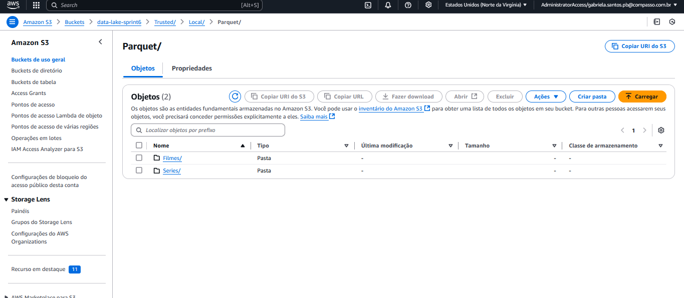
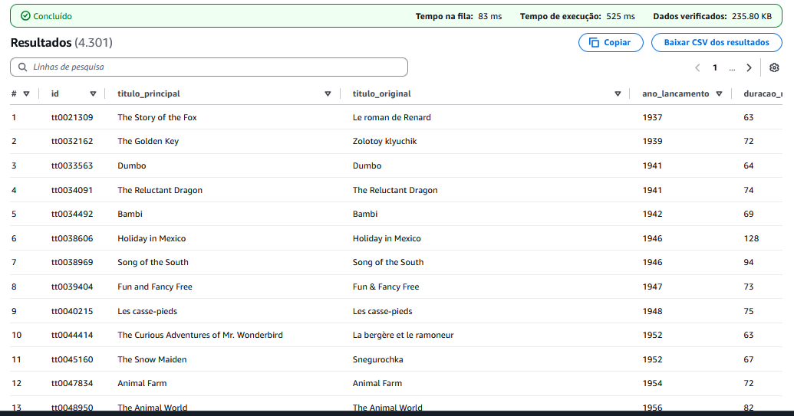
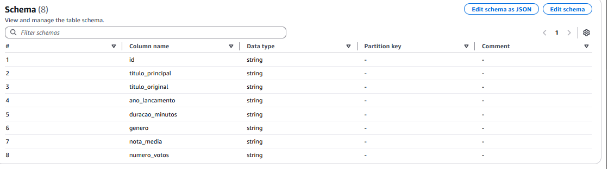
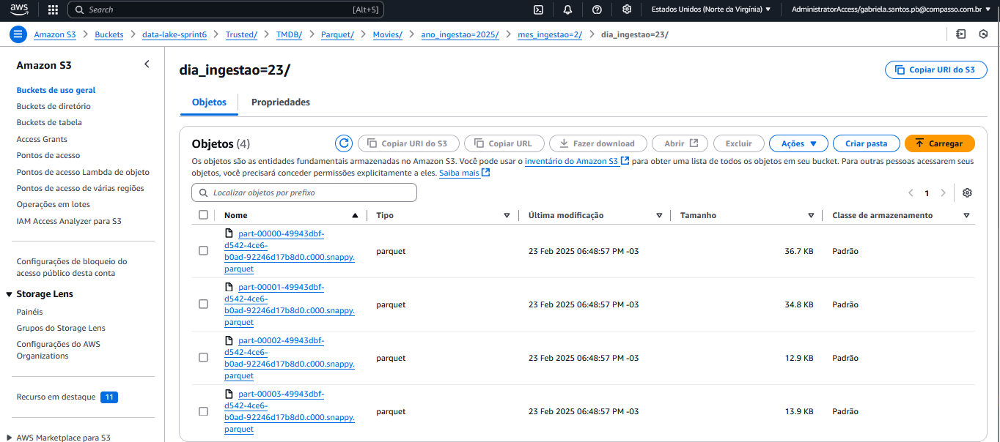
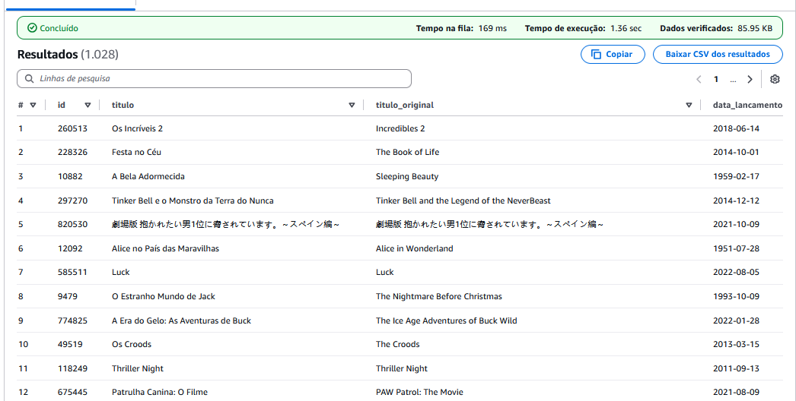
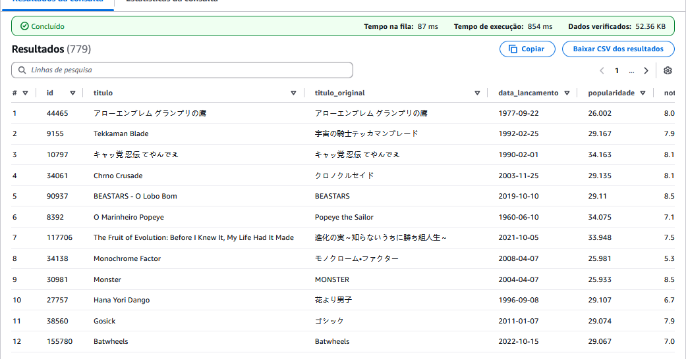
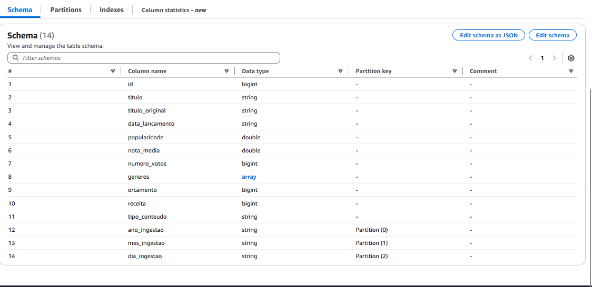

# Sobre

Nosso objetivo nessa sprint foi realizar a implementação da camada Trusted no Data Lake, utilizando AWS Glue para processar dados da camada Raw e transformá-los em um formato confiável e acessível via AWS Athena.

# Instruções: Como foi realizado o desafio


## Perguntas Selecionadas para Análise

Eu acabei mudando minha análise deixando ela menos geral, decidi analisar a franquia *Pokemon* e sua evolução conforme o passar do tempo levando em consideração a popularidade ao longo dos anos, lucratividade e comparação com outras franquias e o contexto histórico e público-alvo com passar dos anos.

- Como a avaliação dos filmes e séries de Pokémon mudou ao longo do tempo?

- Quais anos tiveram os maiores picos de popularidade para filmes e séries de Pokémon?

- Existe correlação entre lançamentos de jogos Pokémon e o aumento do interesse nos filmes/séries?

- Como a quantidade de lançamentos de filmes e séries mudou com o tempo?

- Como a receita dos filmes Pokémon evoluiu até 2022?

- Comparando com outras animações (Digimon, Dragon Ball, One Piece etc.), Pokémon foi mais ou menos lucrativo?

- Existe relação entre a bilheteria dos filmes Pokémon e os períodos de maior venda dos jogos?

- Qual foi o impacto do lançamento de Pokémon GO (2016) na popularidade dos filmes e séries?

- Como a pandemia de COVID-19 impactou os lançamentos e a popularidade da franquia?

- Os filmes recentes são voltados para o público original (adultos nostálgicos) ou continuam mirando em crianças?

# Analisando Jobs 

Aqui estão os jobs que foram criados para processar os dados da camada Raw e transformá-los em um formato confiável na camada Trusted.

## Job 1: Processamento de Dados CSV pra Camada Trusted

Este job foi responsável por processar os dados de filmes e séries que estavam armazenados em formato CSV na camada Raw. O objetivo foi limpar, transformar e salvar esses dados em formato Parquet na camada Trusted.

### Código do Job

```python
import sys
from pyspark.sql.types import StructType, StructField, StringType, IntegerType, FloatType
from awsglue.transforms import *
from awsglue.utils import getResolvedOptions
from pyspark.context import SparkContext
from awsglue.context import GlueContext
from awsglue.job import Job
from pyspark.sql.functions import col, lower, trim, when

# Inicializa o contexto do Glue
args = getResolvedOptions(sys.argv, ['JOB_NAME'])
sc = SparkContext()
glueContext = GlueContext(sc)
spark = glueContext.spark_session
job = Job(glueContext)
job.init(args['JOB_NAME'], args)

# Caminho correto dos arquivos CSV na Raw Zone 
s3_input_filmes = "s3://data-lake-sprint6/Raw/Local/CSV/Filmes/"
s3_input_series = "s3://data-lake-sprint6/Raw/Local/CSV/Series/"

# Definir o esquema manualmente para os arquivos CSV
schema = StructType([
    StructField("id", StringType(), True),  
    StructField("tituloPincipal", StringType(), True),
    StructField("tituloOriginal", StringType(), True),
    StructField("anoLancamento", IntegerType(), True),
    StructField("tempoMinutos", IntegerType(), True),
    StructField("genero", StringType(), True),
    StructField("notaMedia", FloatType(), True),
    StructField("numeroVotos", IntegerType(), True)
])

# Lendo os arquivos CSV dentro de todas as subpastas com delimitador '|'
filmes_df = spark.read.option("header", "true").option("delimiter", "|").schema(schema).csv(s3_input_filmes + "*/*/*/*.csv")
series_df = spark.read.option("header", "true").option("delimiter", "|").schema(schema).csv(s3_input_series + "*/*/*/*.csv")

# Verificando os dados lidos
print("Dados de Filmes (antes da limpeza):")
filmes_df.show(5, truncate=False)
print("Dados de Séries (antes da limpeza):")
series_df.show(5, truncate=False)

# Padronizando os nomes das colunas
columns_rename = {
    "id": "id",
    "tituloPincipal": "titulo_principal",
    "tituloOriginal": "titulo_original",
    "anoLancamento": "ano_lancamento",
    "tempoMinutos": "duracao_minutos",
    "genero": "genero",
    "notaMedia": "nota_media",
    "numeroVotos": "numero_votos"
}

filmes_df = filmes_df.selectExpr([f"{col} as {new_col}" for col, new_col in columns_rename.items()])
series_df = series_df.selectExpr([f"{col} as {new_col}" for col, new_col in columns_rename.items()])

# Removendo duplicatas
filmes_df = filmes_df.dropDuplicates()
series_df = series_df.dropDuplicates()

# Normalizando espaços vazios e tratando valores nulos
for column in filmes_df.columns:
    filmes_df = filmes_df.withColumn(column, trim(col(column)))  # Remove espaços em branco
    filmes_df = filmes_df.withColumn(column, when(col(column) == "", None).otherwise(col(column)))  # Substitui strings vazias por None

for column in series_df.columns:
    series_df = series_df.withColumn(column, trim(col(column)))  
    series_df = series_df.withColumn(column, when(col(column) == "", None).otherwise(col(column)))  

# Verificando os dados após a limpeza
print("Dados de Filmes (após a limpeza):")
filmes_df.show(5, truncate=False)
print("Dados de Séries (após a limpeza):")
series_df.show(5, truncate=False)

# Normaliza o campo 'genero' (remove espaços extras e converte para minúsculas)
filmes_df = filmes_df.withColumn("genero", trim(lower(col("genero"))))
series_df = series_df.withColumn("genero", trim(lower(col("genero"))))

# Filtrando apenas animações (com variações de "Animation" e "Animação")
filmes_df = filmes_df.filter(col("genero").rlike("(?i)animation|animação"))
series_df = series_df.filter(col("genero").rlike("(?i)animation|animação"))

# Verificando os dados filtrados
print("Dados de Filmes após filtro:")
filmes_df.show(5, truncate=False)
print("Dados de Séries após filtro:")
series_df.show(5, truncate=False)

# Caminhos de saída na Trusted Zone
s3_output_filmes = "s3://data-lake-sprint6/Trusted/Local/Parquet/Filmes/"
s3_output_series = "s3://data-lake-sprint6/Trusted/Local/Parquet/Series/"

# Salvando como PARQUET 
filmes_df.write.mode("overwrite").parquet(s3_output_filmes)
series_df.write.mode("overwrite").parquet(s3_output_series)

job.commit()
```

## Explicação do Job csv

#### Leitura dos Dados:

O job começa lendo os arquivos CSV da camada Raw, que estão armazenados no S3. Os dados são lidos com um esquema definido manualmente para garantir a consistência dos tipos de dados.

#### Limpeza e Transformação:

#### Padronização de Colunas:

Os nomes das colunas são padronizados para facilitar a manipulação.

#### Remoção de Duplicatas:

As duplicatas são removidas para garantir a integridade dos dados.

#### Tratamento de Valores Nulos:

Espaços em branco e strings vazias são substituídos por None.

#### Filtragem por Gênero: 

Apenas os registros que contêm "Animation" ou "Animação" no campo genero são mantidos.

#### Salvamento dos Dados: 

Os dados limpos e transformados são salvos em formato Parquet na camada Trusted, prontos para serem consultados via AWS Athena.

## Resultado

#### Camada trusted



#### Resultado athena



#### Schema CSV




# Job 2: Processamento de Dados TMDB pra Camada Trusted

Este job foi responsável por processar os dados da API do TMDB, que estavam armazenados em formato JSON na camada Raw. O objetivo foi filtrar apenas as animações, padronizar os nomes das colunas e salvar os dados em formato Parquet na camada Trusted.

### Código do Job

``` python 
import sys
from awsglue.transforms import *
from awsglue.utils import getResolvedOptions
from pyspark.context import SparkContext
from awsglue.context import GlueContext
from awsglue.job import Job
from pyspark.sql.functions import col, array_contains, lit, when
from datetime import datetime

# Inicializa o contexto do Glue
args = getResolvedOptions(sys.argv, ['JOB_NAME'])
sc = SparkContext()
glueContext = GlueContext(sc)
spark = glueContext.spark_session
job = Job(glueContext)
job.init(args['JOB_NAME'], args)

# Caminho de entrada na Raw Zone
s3_input_path = "s3://data-lake-sprint6/Raw/TMDB/JSON/2025/02/23/"

# Extrai ano, mês e dia do caminho de entrada 
ano, mes, dia = s3_input_path.strip("/").split("/")[-3:]

# Lendo os arquivos JSON
tmdb_df = spark.read.option("multiline", "true").json(s3_input_path)

# Verificando se o campo genre_ids existe e filtra apenas animações (gênero 16)
if "genre_ids" in tmdb_df.columns:
    tmdb_df = tmdb_df.filter(array_contains(col("genre_ids"), 16))
else:
    raise ValueError("O campo 'genre_ids' não foi encontrado no DataFrame.")

# Padonizando os nomes das colunas
tmdb_df = tmdb_df.select(
    col("id").alias("id"),
    when(col("tipo_conteudo") == "tv", col("name")).otherwise(col("title")).alias("titulo"),  
    when(col("tipo_conteudo") == "tv", col("original_name")).otherwise(col("original_title")).alias("titulo_original"),  
    when(col("tipo_conteudo") == "tv", col("first_air_date")).otherwise(col("release_date")).alias("data_lancamento"),  
    col("popularity").alias("popularidade"),
    col("vote_average").alias("nota_media"),
    col("vote_count").alias("numero_votos"),
    col("genre_ids").alias("generos"),
    col("budget").alias("orcamento"),
    col("revenue").alias("receita"),
    col("tipo_conteudo").alias("tipo_conteudo")  
)

# Tratando os valores nulos 
tmdb_df = tmdb_df.fillna({"orcamento": 0, "receita": 0})

# Adiciona colunas de partição (ano_ingestao, mes_ingestao, dia_ingestao) e usa a data de ingestão (ano, mes, dia extraídos do caminho de entrada) como valores padrão
tmdb_df = tmdb_df.withColumn("ano_ingestao", lit(ano).cast("int")) \
                 .withColumn("mes_ingestao", lit(mes).cast("int")) \
                 .withColumn("dia_ingestao", lit(dia).cast("int"))

# Caminho de saída na Trusted Zone para Filmes
s3_output_filmes_path = "s3://data-lake-sprint6/Trusted/TMDB/Parquet/Movies/"

# Caminho de saída na Trusted Zone para Séries
s3_output_series_path = "s3://data-lake-sprint6/Trusted/TMDB/Parquet/Series/"

# Filtra e salva os dados de filmes
filmes_df = tmdb_df.filter(col("tipo_conteudo") == "movie")
filmes_df.write.mode("overwrite") \
    .partitionBy("ano_ingestao", "mes_ingestao", "dia_ingestao") \
    .parquet(s3_output_filmes_path)

# Filtra e salva os dados de séries
series_df = tmdb_df.filter(col("tipo_conteudo") == "tv")
series_df.write.mode("overwrite") \
    .partitionBy("ano_ingestao", "mes_ingestao", "dia_ingestao") \
    .parquet(s3_output_series_path)

job.commit()
```

## Explicação do Job 2

#### Leitura dos Dados:

O job começa lendo os arquivos JSON da camada Raw, que estão armazenados no S3. Os dados são lidos com a opção multiline para garantir que o formato JSON seja corretamente interpretado.

#### Filtragem por Gênero:

Apenas os registros que contêm o gênero 16 (Animação) no campo genre_ids são mantidos.

#### Padronização de Colunas: 

Os nomes das colunas são padronizados para facilitar a manipulação. Diferentes campos são mapeados dependendo do tipo de conteúdo (filme ou série).

#### Tratamento de Valores Nulos: 

Os valores nulos nas colunas orcamento e receita são substituídos por 0.

#### Adição de Colunas de Partição: 

Colunas de partição (ano_ingestao, mes_ingestao, dia_ingestao) são adicionadas para facilitar a organização e consulta dos dados.

#### Salvamento dos Dados: 

Os dados são salvos em formato Parquet na camada Trusted, particionados por ano, mês e dia de ingestão.

## Resultado

#### Camada trusted




#### Resultado Athena

##### Movies



##### Series



#### Schema Tmdb



