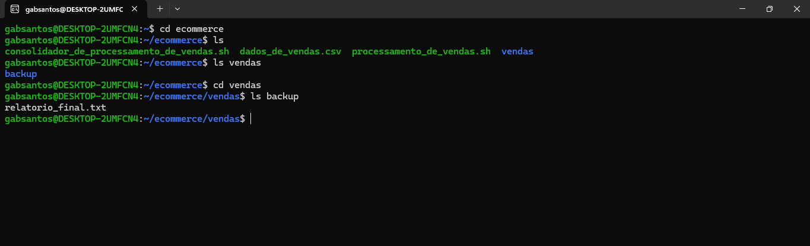
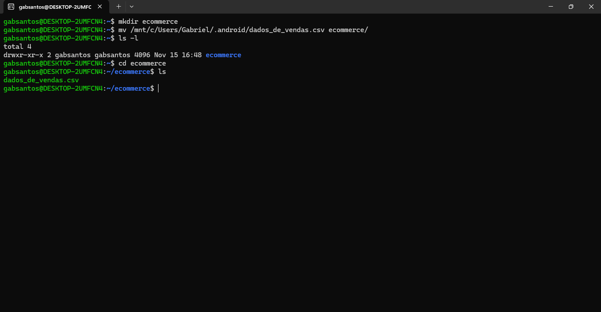
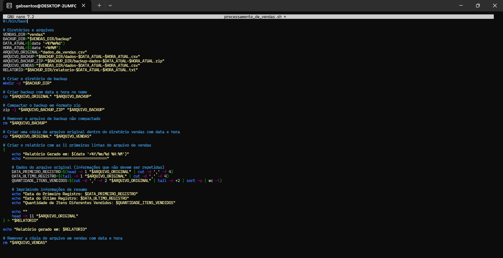
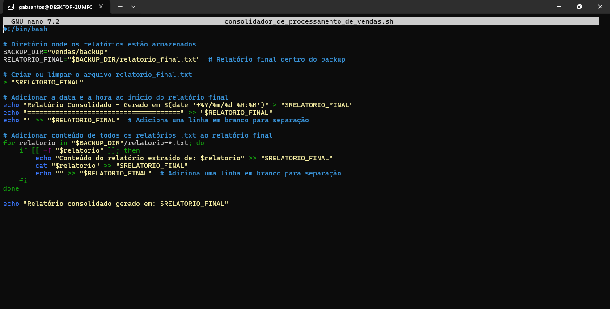
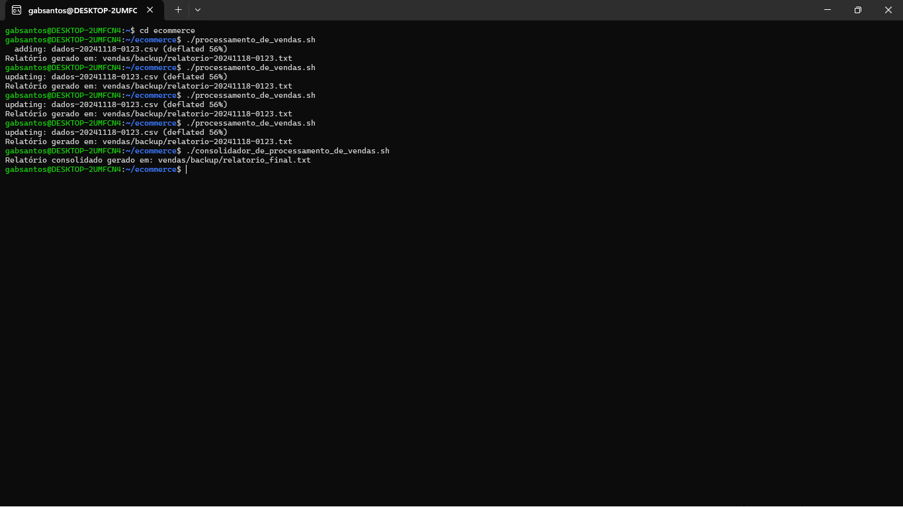
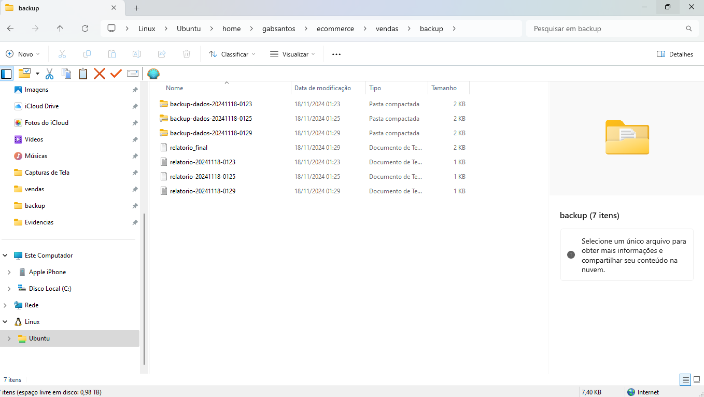
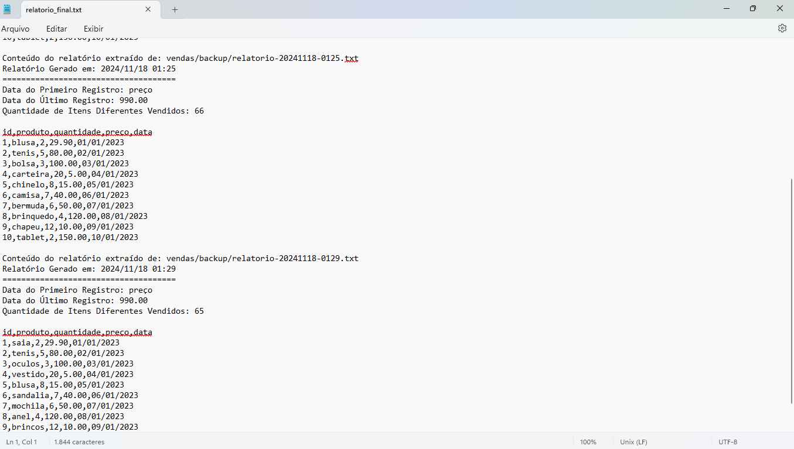
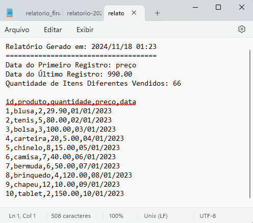
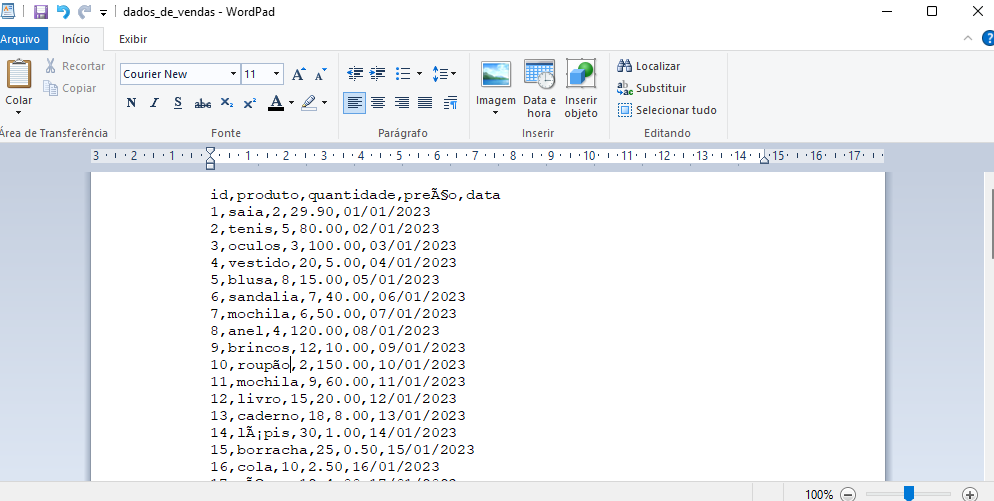

# Sobre

Então antes de apresentar de fato o que eu realizei, vou falar brevemente sobre o intuito dele e qual de fato é o desafio.

O desafio tem como intuito principal mostrar nossa pratica com comandos de *Linux* e *Markdown*.

Bom, nesse desafio irei utilizar comandos no linux pra processar e gerar um relátorio de vendas. Ele também vai ter um comando onde é feito um agendamento da execução. Enfim, entrarei em mais detealhes quando chegarmos lá. 


# Instruções, como foi realizado de fato o desafio.


#### Antes de lhe explicar como foi criado, eu vou mostrar como ficaram os diretorios criados com os arquivos dentro e mais a frente entro em detalhes como criei, eu acabei esquecendo de tirar print na hora que criei os diretorios, mas tentarei ao máximo deixar o mais fiel possível na hora que realizei tudo.
 #### A imagem segue abaixo.




### 1. Criação dos diretórios e inserção dos arquivos.


Bom, primeiramente eu realizei a criação do diretório "ecommerce" usando o comando:

``` bash
mkdir ecommerce
```
e movi o arquivo dados_de_vendas.csv da pasta a qual ele estava para o dir ecommerce:

``` bash
mv mnt/c/Users/Gabriel/.android/dados_de_vendas.csv ecommerce/
```
usei um comando que vou por abaixo para listar pra ver se estava tudo certinho.

``` bash
ls 
```

vou por o print abaixo disso:



Após isso eu criei o diretorio de vendas dentro do ecommerce e copiei o arquivo dados_de_vendas.csv pra dentro dele. Infelizmente eu não tirei print dessa parte quando criei, mas irei por o comando abaixo:

``` bash
mkdir vendas
cp ecommerce/dados_de_vendas.csv ecommerce/vendas/
``` 

Eu adicionei o dir de backup dentro de vendas também com o seguinte comando. 

``` bash
mkdir backup
```

Enfim, após a realização disso eu criei um arquivo sh com o uso do editor de texto nano dentro do diretório ecommerce com o comando abaixo:

``` bash
    nano processador_de_vendas.sh
```

*obs:* Esse comando eu utilizo pra abrir o arquivo também mais pra frente pra adicionar o script dentro dele. Enfim, veremos isso mais pra frente.

Eu também realizei a criação do arquivo sh consolidador dentro do ecommerce com o comando:

``` bash
    nano consolidador_de_processo_de_vendas.sh
```


### 2. Criação dos Scripts no Editor de Texto Nano e Concessão de Permissões para Arquivos Executáveis.


Bom eu utilizei o comando que falei acima pra abrir o editor de texto do arquivo sh e ao utiliza-lo abre se essa janelinha aqui no terminal. No caso, vou colocar ela ja com o script dentro pra não ficar muito extenso. 

Abaixo está a imagem do script processador_de_vendas.sh.



Por ser maior irei por partes, para facilitar o entendimento. Bom logo no inicio do código eu defini as variáveis que são:

#### Explicação das Variáveis no Script processador_de_vendas.sh

No script, utilizei diversas variáveis para organizar e manipular os arquivos de vendas e seus backups de maneira mais eficiente possivel. Abaixo vou dar uma breve explicação do que cada uma está fazendo.

1. *`VENDAS_DIR`*: Essa variável tem o caminho para o diretório onde os arquivos relacionados às vendas são armazenados.

    ```bash
    VENDAS_DIR="vendas"
    ```

2. **`BACKUP_DIR`**: Essa armazena o caminho para o diretório onde os backups dos arquivos de vendas serão salvos.
    ```bash
    BACKUP_DIR="$VENDAS_DIR/backup"
    ```

3. **`DATA_ATUAL`**: Utilizo essa variável para incluir a data atual no nome dos arquivos, o que ajuda a manter o controle das versões de backup e dos relatórios gerados. 

    ```bash
    DATA_ATUAL=$(date '+%Y%m%d')
    ```

    *Obs:* O comando `date` é utilizado para pegar a data atual do sistema.

4. **`HORA_ATUAL`**: Similar à variável anterior, ela é usada para incluir a hora nos nomes dos arquivos, garantindo que cada execução do script tenha arquivos únicos, sem sobrescrever os anteriores.

    ```bash
    HORA_ATUAL=$(date '+%H%M')
    ```

5. **`ARQUIVO_ORIGINAL`**: Esta variável define o nome do arquivo original que contém os dados de vendas. Ele é denominado dados_de_vendas.csv e serve como entrada para o processo de backup e processamento no script.

    ```bash
    ARQUIVO_ORIGINAL="dados_de_vendas.csv"
    ```

6. **`ARQUIVO_BACKUP`**: Essa variável armazena o caminho e o nome do arquivo de backup, que é uma cópia do `ARQUIVO_ORIGINAL`. O nome do arquivo de backup é composto pelo nome base `dados-`, seguido da data e hora da execução, o que torna cada arquivo único.

    ```bash
    ARQUIVO_BACKUP="$BACKUP_DIR/dados-$DATA_ATUAL-$HORA_ATUAL.csv"
    ```

7. **`ARQUIVO_BACKUP_ZIP`**: Similar ao `ARQUIVO_BACKUP`, esta variável armazena o caminho e nome do arquivo compactado (em formato zip) do backup. 

    ```bash
    ARQUIVO_BACKUP_ZIP="$BACKUP_DIR/backup-dados-$DATA_ATUAL-$HORA_ATUAL.zip"
    ```

    *obs*: Como pedido no desafio a compactação foi feita para reduzir o tamanho do arquivo e facilitar o armazenamento.

8. **`ARQUIVO_VENDAS`**: Ela armazena o caminho e o nome de uma cópia do arquivo de vendas original que será armazenado no diretório `vendas`, com a data e hora da execução, para fins de organização.

    ```bash
    ARQUIVO_VENDAS="$VENDAS_DIR/dados-$DATA_ATUAL-$HORA_ATUAL.csv"
    ```

9. **`RELATORIO`**: Ela armazena o caminho e nome do arquivo de relatório gerado. Esse relatório contém informações resumidas sobre o arquivo de vendas, como as datas dos primeiros e últimos registros e a quantidade de itens vendidos. O arquivo é gerado no diretório de backup e também inclui a data e hora no nome para facilitar a identificação.

    ```bash
    RELATORIO="$BACKUP_DIR/relatorio-$DATA_ATUAL-$HORA_ATUAL.txt"
    ```

Bom, após definir as variáveis, o script agora começa a executar as ações que estão relacionadas ao backup e a criação do relatorio. 

#### Execuções no script processador_de_vendas.sh

O primeiro comando utilizado foi:

``` bash
mkdir -p "$BACKUP_DIR"
```

Com uso dele eu tive o intuito de garantir que o diretório de backup seja criado durante a execução do script, caso ainda não exista. Ele verifica se o diretório está presente, caso não esteja, ele o cria.

Em seguida, com o comando abaixo:

``` bash
cp "$ARQUIVO_ORIGINAL" "$ARQUIVO_BACKUP"
```

 o arquivo original dados_de_vendas.csv é copiado para o diretório de backup com um nome que inclui a data e hora atual. Isso garante que o backup seja único e possa ser facilmente identificado.

 Após isso usei o comando:

``` bash
 zip -j "$ARQUIVO_BACKUP_ZIP" "$ARQUIVO_BACKUP"
```

Para compactar o arquivo de backup no formato .zip, removendo qualquer diretório original e gerando um arquivo compactado. 

E após essa compactação, o arquivo de backup original (não compactado) é removido com o comando:

``` bash
rm "$ARQUIVO_BACKUP"
```

 liberando assim o espaço e mantendo apenas o arquivo compactado.

 Depois que isso ocorre é criado uma cópia do arquivo original(dados_de_vendas.csv) no diretório vendas, novamente com a data e hora atual no nome. Segue o comando abaixo:

``` bash
 cp "$ARQUIVO_ORIGINAL" "$ARQUIVO_VENDAS"
```

A data e a hora atual no nome vai garantir que cada versão do arquivo seja identificado de maneira única.

Ao fim disso tudo o nosso script gera um relatório utilizando o comando echo para incluir a data de criação do relatório e algumas informações de resumo extraídas do arquivo de vendas, como a data do primeiro e último registro e a quantidade de itens diferentes vendidos.

``` bash
{
    echo "Relatório Gerado em: $(date '+%Y/%m/%d %H:%M')"
    echo "====================================="

    # Dados do arquivo original
    DATA_PRIMEIRO_REGISTRO=$(head -n 1 "$ARQUIVO_ORIGINAL" | cut -d ',' -f 4)
    DATA_ULTIMO_REGISTRO=$(tail -n 1 "$ARQUIVO_ORIGINAL" | cut -d ',' -f 4)
    QUANTIDADE_ITENS_VENDIDOS=$(cut -d ',' -f 2 "$ARQUIVO_ORIGINAL" | tail -n +2 | sort -u | wc -l)

    # Informações de resumo
    echo "Data do Primeiro Registro: $DATA_PRIMEIRO_REGISTRO"
    echo "Data do Último Registro: $DATA_ULTIMO_REGISTRO"
    echo "Quantidade de Itens Diferentes Vendidos: $QUANTIDADE_ITENS_VENDIDOS"

    echo ""
    head -n 11 "$ARQUIVO_ORIGINAL"
} > "$RELATORIO"
```


Bom eu sei que no desafio é pedido as 10 primeiras linhas do arquivo original, mas no comando acima eu coloquei pra ele incluir as 11 primeiras linhas pra exibir os 10 primeiros produtos com o que cada informação é na tabela, quando eu exibir o resultado você irá entender.

Por fim, eu coloco mais dois comandos, um que após a criação do relatório exibe a mensagem indicando onde o relatório foi gerado.

``` bash
echo "Relatório gerado em: $RELATORIO"
```
E outro, que por sua vez remove a cópia do arquivo original no diretório vendas, que foi criada para facilitar o processamento.

``` bash
rm "$ARQUIVO_VENDAS"
```

Ao fim disso tudo salvamos clicando *`"Ctrl+o"`* depois o botão *`"Enter"`* e fechando a janela com *`"ctrl+x"`* usei o comando para dar as permissões ao arquivo.

``` bash
chmod +x processador_de_vendas.sh
```

#### Explicação das Variáveis no Script consolidador_de_processamento_de_vendas.sh

Esse script, em comparação com o anterior, ficou menor tanto na quantidade de variaveis quanto na parte de execução, até porque ele foca em consolidar relatórios já gerados em um único arquivo, sem realizar tantas operações de backup e manipulação de dados.

Imagem do script consolidador_de_processamento_de_vendas abaixo.



Abaixo vou falar brevemente sobre as variáveis deste script.

Na variável a seguir:

``` bash
BACKUP_DIR="vendas/backup"
```

Define o caminho onde os relatórios de backup estão armazenados. No caso, o diretório vendas/backup.

Já essa variável:

``` bash
RELATORIO_FINAL="$BACKUP_DIR/relatorio_final.txt"
```

Ela armazena o caminho do arquivo onde será salvo o relatório consolidado, chamado relatorio_final.txt e ele ficará dentro do diretório de backup.

#### Execuções no script consolidador_de_processamento_de_vendas.sh

O comando abaixo:

``` bash
> "$RELATORIO_FINAL"
```

Ele garante que o arquivo relatorio_final.txt seja limpo, ou, caso não exista, ele será criado. Isso evita que dados de execuções anteriores se misturem com os novos dados.

Agora, com este comando.

``` bash
echo "Relatório Consolidado - Gerado em $(date '+%Y/%m/%d %H:%M')" > "$RELATORIO_FINAL"
echo "======================================" >> "$RELATORIO_FINAL"
echo "" >> "$RELATORIO_FINAL" 
```

 O script começa o relatório com a data e hora em que ele foi gerado. Isso é útil para identificar quando o relatório foi gerado e evita confusão em relatórios antigos.

O comando

``` bash
for relatorio in "$BACKUP_DIR"/relatorio-*.txt; do
    if [[ -f "$relatorio" ]]; then
        echo "Conteúdo do relatório extraído de: $relatorio" >> "$RELATORIO_FINAL"
        cat "$relatorio" >> "$RELATORIO_FINAL"
        echo "" >> "$RELATORIO_FINAL" 
    fi
done
```

 O laço de repetição percorre todos os arquivos .txt do diretório de backup que começam com "relatorio-" e os adiciona ao relatório final. Para cada arquivo encontrado, ele adiciona o conteúdo e uma linha explicativa sobre de onde o conteúdo foi extraído.

 Enfim, depois de adicionar o conteúdo de todos os relatórios ao relatorio_final.txt, o script exibe uma mensagem dizendo onde o relatório consolidado foi gerado.
 
``` bash
 echo "Relatório consolidado gerado em: $RELATORIO_FINAL"
```
Bom após isso tudo realizamos as mesmas coisas do anterior clicando *`"Ctrl+o"`* depois o botão *`"Enter"`* para salvar e fechando a janela com *`"ctrl+x"`* após isso usamos o comando abaixo para dar permissões para esse arquivo também.

``` bash
chmod +x consolidador_de_processamento_de_vendas.sh
```

### Resultados da execução dos scripts

Bom primeiro eu utilizei os comandos abaixo para executar manualmente os arquivos.

``` bash
./processador_de_vendas.sh
./consolidador_de_processamento_de_vendas.sh
```



No exemplo acima eu acabei usando manualmente o comando no mesmo horario e ele criou e ficou substituindo o arquivo, pois como não coloquei os segundos na "hora_atual" quando declarei como ua variável no script ele so criar novos quando passa os minutos. Vou botar exemplos abaixos de como ele fica na pasta backup.



Abaixo vou colocar o resultado do relatorio final após executarmos manualmente o consolidador.



Ele de fato une os relatorios criados, agora abaixo o resultado de como fica o relatorio criado quando executarmos o processador_de_venda.



e bom eu alterei os dados manualmente no wordpad, vou deixar a imagem abaixo, pra ver se estava salvando e como você pode ver nos resultados acima ele está alterando sim!

