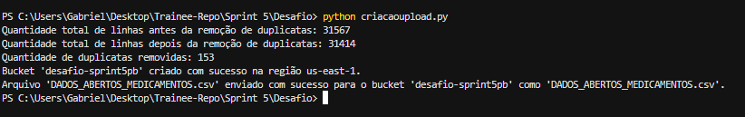
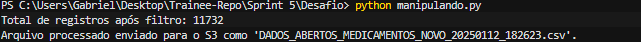
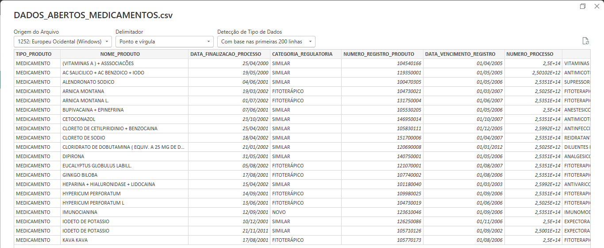
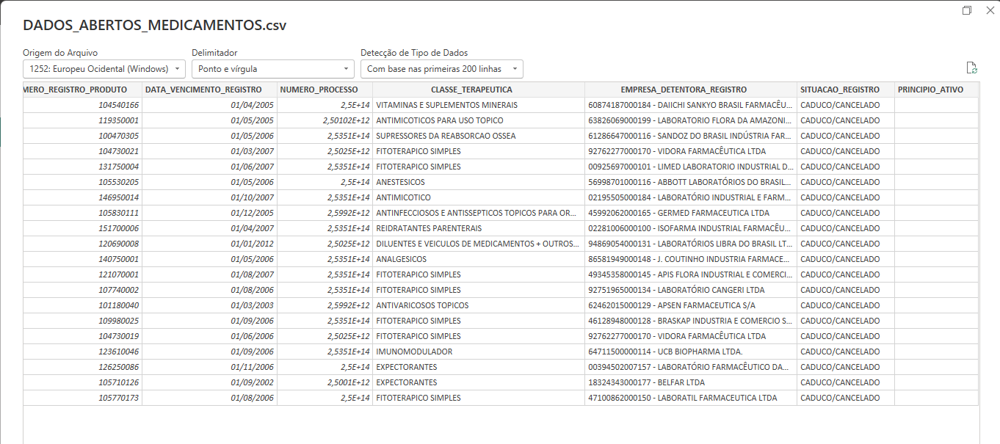
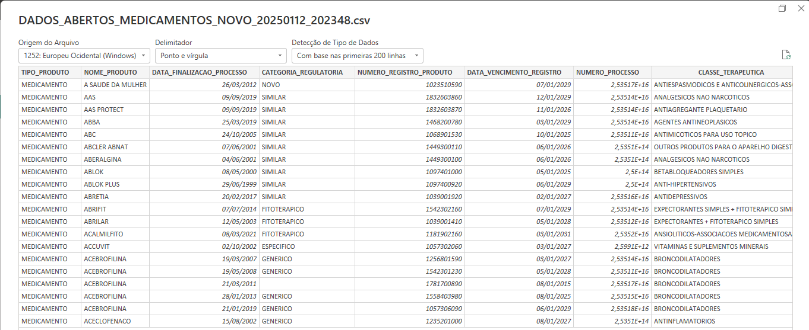
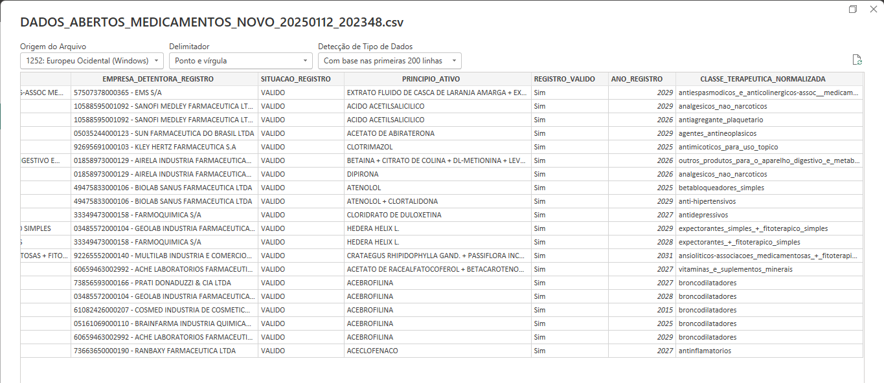
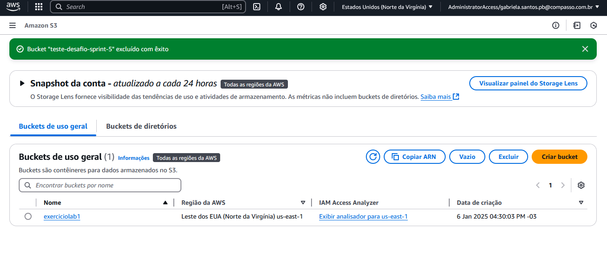
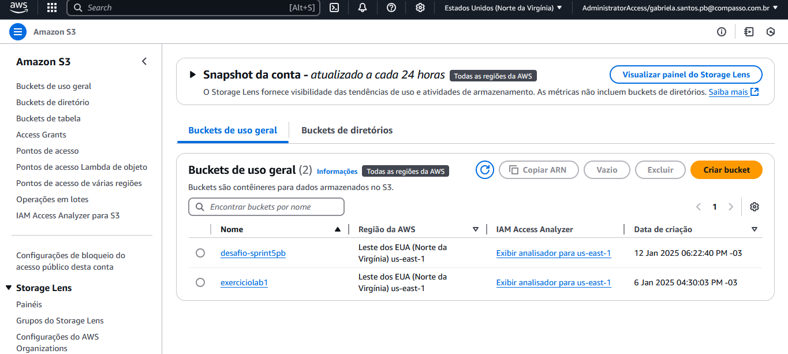
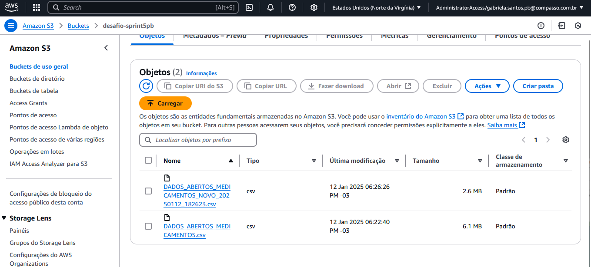

# Sobre

Nosso objetivo foi aplicar os conhecimentos adquiridos sobre AWS e Python. Trabalhamos com um arquivo CSV, baixado do site dados.gov.br, onde realizamos manipulações nos dados localmente e, em seguida, enviamos o arquivo processado para um bucket no AWS S3.


# Instruções, como foi realizado de fato o desafio.

#### Antes de eu começar a explicar o código em si precisamos realizar algumas coisas como:

- Bibliotecas usadas: Boto3, Pandas, Botocore (utilizada diretamente, mas já inclusa como dependência do Boto3) e io.StringIO,unicodedata e datetime (nativas do Python).

<p>

- Instalações necessárias: Biblioteca Pandas e Boto3, Python e Vscode(caso você faça por ele, eu fiz), AWS Cli,  Extensões de Python AWS Toolkit (útil para integração e visualização de recursos AWS).

Codigo usado no terminal (Windows) para instalação das Bibliotecas:

``` bash
pip install boto3 pandas
```
<p>

### **0. Configurando Acesso ao AWS através do AWS CLI (SSO)**

#### Aviso e instalação

Bom, essa parte `0` eu coloquei partindo do ponto que é algo que temos de fazer antes de começarmos de fato o desafio, é algo necessário pois se não realizamos esse passo, não conseguimos fazer todo o resto.

A principio nós baixamos e instalamos o AWS CLI, caso não tenhamos instalado em nossa maquina, para isso vamos para o site oficial deles e instalamos de acordo com nosso sistema operacional. 

#### Configurando no Terminal

Após isso, no terminal (usei do windows) digitamos o seguinte comando.

``` bash
aws configure sso
```
ele vai te dar as seguintes respostas e vamos respondendo uma por vez com as respotas que irei por abaixo.

``` bash
SSO session name (Recommended): nomedesuaescolhapsessão

###aqui colocamos a url que nos é disponibilizada nessa sprint

SSO start URL [None]: https://my-sso-portal.awsapps.com/start 

### colocamos a região que vamos usar

SSO region [None]: us-east-1

### nessa parte eu apenas cliquei enter pra usar a configuração padrão

SSO registration scopes [None]: 

### Apos isso ele vai carregar uma url que ira nos jogar para uma pagina onde permitiremos o acesso após isso ele vai ir pra próxima questão, aqui, você deve inserir a região padrão que será usada para as operações com o AWS CLI. Por exemplo: us-east-1

CLI default client Region [None]: us-east-1

## Depois, podemos selecionar o formato de saída das respostas do AWS CLI. As opções disponíveis são: json (padrão), text, table e csv. No caso eu acabei escolhendo a csv.

CLI default output format [None]: csv

## E, por fim, o terminal vai nos retornar a seguinte mensagem de confirmação

Successfully configured SSO session: <nomedesuaescolhapsessão>
```

*obs:* Após realizar tudo isso, para garantirmos que a sessão está ativa e autenticada, executamos o seguinte comando.

``` bash
aws sso login
```

Se a sessão já estiver ativa, o terminal nos confirmará que estamos logados e tudo está configurado corretamente,caso contrário, ele abrirá novamente o navegador para nos efetuarmos o login.


### **1. Criando o Bucket e carregando o arquivo .csv pro S3 através de um script .py (criacaoupload.py)**

Primeiramente, o arquivo .csv que decidi utilizar da pagina dados.gov.br foi `DADOS ABERTOS MEDICAMENTOS`, que basicamente mostra os medicamentos registrados no Brasil.

Bom, nessa parte utilizei as seguintes bibliotecas.

``` bash
import pandas as pd
import boto3
from botocore.exceptions import ClientError
```

#### Removendo as duplicatas

De inicio, selecionei o arquivo `DADOS ABERTOS MEDICAMENTOS` e removi suas duplicatas com base na coluna `NUMERO_PROCESSO ` e coloquei para exibir após a remoção das duplicatas, quantas linhas haviam antes e após a remoção e quantas linhas foram removidas. 

Abaixo deixarei o trecho do código onde realizo isso.

``` python
file_path = "DADOS_ABERTOS_MEDICAMENTOS.csv"

# Releitura do arquivo original com separador e codificação apropriados

def remover_duplicatas(file_path):
    try:
        data_original = pd.read_csv(file_path, sep=";", encoding="ISO-8859-1", on_bad_lines="skip")

        # Nome da coluna usada para remover duplicatas

        coluna_chave = "NUMERO_PROCESSO"

        # Quantidade total de linhas antes de remover duplicatas

        total_linhas_antes = data_original.shape[0]

        # Removendo duplicatas com base na coluna especificada

        data_sem_duplicatas = data_original.drop_duplicates(subset=[coluna_chave])

        # Quantidade total de linhas depois de remover duplicatas

        total_linhas_depois = data_sem_duplicatas.shape[0]

        # Quantidade de duplicatas removidas

        duplicatas = total_linhas_antes - total_linhas_depois

        # Exibindo mensagens

        print(f"Quantidade total de linhas antes da remoção de duplicatas: {total_linhas_antes}")

        print(f"Quantidade total de linhas depois da remoção de duplicatas: {total_linhas_depois}")

        print(f"Quantidade de duplicatas removidas: {duplicatas}")

        return data_sem_duplicatas
    except Exception as e:
        print(f"Erro ao processar o arquivo: {e}")

```

<p>

#### Criando o Bucket no S3

Bom, após fazer aquela parte, fui para a questão de criar o bucket através do script. Para isso usei a biblioteca *boto3*, realizei a conexão com o s3 usando-a e declarei o nome e a região também neste inicio. Veja abaixo.

``` python
# Configuração do cliente S3, nome do bucket e região
s3 = boto3.client('s3')
nome_bucket = 'desafio-sprint5pb'
regiao = 'us-east-1'
```

<p>

Depois disso, criei uma função que lê os buckets listados, verifica se o bucket que desejamos criar existe, se existir nos será informado a existencia do bucket, caso contrario ele seguirá com o script e criará um bucket na região selecionada. Caso hajam erros durante a execução do Script ele será nos informado de acordo. 

Abaixo podemos ver o código.

```python
def criando_bucket(nome_bucket, regiao='us-east-1'):
    try:
        # Listando os buckets existentes

        response = s3.list_buckets()
        buckets_existentes = [bucket['Name'] for bucket in response.get('Buckets', [])]

        # Verificando se o bucket já existe

        if nome_bucket in buckets_existentes:
            print(f"O bucket '{nome_bucket}' já existe.")
        else:
            if regiao == 'us-east-1':

                # Cria o bucket sem a configuração de região (us-east-1 é a região padrão)

                s3.create_bucket(Bucket=nome_bucket)
            else:
                # Cria o bucket com a configuração de região

                s3.create_bucket(
                    Bucket=nome_bucket,
                    CreateBucketConfiguration={'LocationConstraint': regiao}
                )
            print(f"Bucket '{nome_bucket}' criado com sucesso na região {regiao}.")
    except ClientError as e:
        print(f"Erro ao criar ou verificar o bucket: {e}")

```
<p>

#### Fazendo upload do arquivo no bucket

Após a verificação e criação do bucket se ele não existir, eu criei a função abaixo onde utilizei o metodo `upload_file` do `boto3` para enviar o arquivo .csv pro bucket e coloquei uma condicional caso aja algum problema durante o envio ele nos exiba no terminal.

``` python
def upload_arquivo(nome_bucket, file_path, s3_key):
    try:
        s3.upload_file(file_path, nome_bucket, s3_key)
        print(f"Arquivo '{file_path}' enviado com sucesso para o bucket '{nome_bucket}' como '{s3_key}'.")
    except Exception as e:
        print(f"Erro ao enviar o arquivo: {e}")
```

<p>

#### Organizando o Script Principal

Por fim, no bloco principal (if __name__ == "__main__"), organizei o fluxo para que todas as etapas sejam executadas sequencialmente como podemos ver abaixo.

``` python
if __name__ == "__main__":

    # Remover duplicatas
    data_sem_duplicatas = remover_duplicatas(file_path)

    # Criar bucket no S3 se não existir
    criando_bucket(nome_bucket, regiao)

    # Fazer upload do arquivo
    s3_key = 'DADOS_ABERTOS_MEDICAMENTOS.csv'
    upload_arquivo(nome_bucket, file_path, s3_key)

```
<p>

resultado do comando no terminal:



### **2. Manipulando o arquivo com as funções exigidas no Desafio (manipulando.py)**

Como pedido no desafio após realizarmos os passos anteriores criamos outro script `manipulando.py` para realizar as manipulações exigidas diretamente nos dados armazenados no S3. Abaixo deixarei as bibliotecas utilizadas nessa parte.

``` python
import boto3
import pandas as pd
from datetime import datetime
from io import StringIO
import unicodedata
```

#### Carregando os dados do S3 e normalizando

Como mostrado abaixo é aqui que definimos o nome do bucket no S3 e a chave do arquivo que será manipulado.

```python
nome_bucket = 'desafio-sprint5pb'
s3_key = 'DADOS_ABERTOS_MEDICAMENTOS.csv'
```


<p>

Pos isso vamos realizar a normalização das strings, o objetivo é garantir que elas fiquem limpas, sem acentos ou caracteres especiais e limpar espaços extras como podemos ver abaixo.

``` python
def normalizar_string(texto):
    
    # Remove acentos e normaliza o texto.

    if isinstance(texto, str):
        return unicodedata.normalize('NFKD', texto).encode('ascii', 'ignore').decode('utf-8').strip()
    return texto

```

<p>

Depois de definir a função de normalização, vamos carregar o arquivo do S3 e aplicar a normalização. Veja abaixo:

```python
s3 = boto3.client('s3')

# Baixar o arquivo do S3 com codificação ISO-8859-1
response = s3.get_object(Bucket=nome_bucket, Key=s3_key)
csv_data = response['Body'].read().decode('ISO-8859-1')
```
 <p>

logo em seguida criamos o DataFrame e garantimos que os nomes das colunas estejam limpos e as strings sejam normalizadas. Código abaixo.

```python
    # Criando o DataFrame e usando ponto e vírgula como separador

    df = pd.read_csv(StringIO(csv_data), sep=';', on_bad_lines="skip")

    # Limpando espaços nos nomes das colunas

    df.columns = df.columns.str.strip()  
    
    # Normalizando todas as strings no DataFrame

    for coluna in df.select_dtypes(include=['object']).columns:
        df[coluna] = df[coluna].apply(normalizar_string)
```

<p>

#### Filtrando dados usando ao menos dois operadores lógicos.

Antes de realizar essa filtragem, é importante garantirmos que as colunas que precisamos estejam presentes no DataFrame. Vamos fazer isso utilizando o código abaixo, caso ele não encontre as colunas necessarias ele irá nos informar.

``` python
# Validando se as colunas necessárias existem
colunas_necessarias = ['TIPO_PRODUTO', 'SITUACAO_REGISTRO']
for coluna in colunas_necessarias:
    if coluna not in df.columns:
        raise ValueError(f"Coluna necessária '{coluna}' não encontrada no DataFrame.")
```

<p>

Com as colunas validadas, agora aplicaremos um filtro nos dados utilizando ao menos dois operadores lógicos, como pedido do no desafio. Veja o código abaixo.

``` python
# Filtrando os dados usando pelo menos dois operadores lógicos

filtro = (df['TIPO_PRODUTO'] == 'MEDICAMENTO') & (df['SITUACAO_REGISTRO'] == 'VALIDO')
df_filtrado = df[filtro].copy()
```

<p>

#### Função de agregação 

Realizamos agregações para resumir os dados filtrados, contamos o número de registros e o número de produtos únicos.

``` Python
# Função de agregação 
agregados = df_filtrado.groupby('TIPO_PRODUTO').agg(
    total_registros=('NUMERO_REGISTRO_PRODUTO', 'count'),
    total_produtos=('NOME_PRODUTO', 'nunique')
)
```

<p>

#### Função Condicional

Bom, nessa função condicional abaixo criamos uma nova coluna `REGISTRO_VALIDO`, que recebe *'Sim'* ou *'Não'* dependendo apenas da situação do registo, no caso, se é sim válido.

``` python
# Função condicional
df_filtrado['REGISTRO_VALIDO'] = df_filtrado['SITUACAO_REGISTRO'].apply(lambda x: 'Sim' if x == 'VALIDO' else 'Não')

```

<p>

#### Função de Conversão

Aqui, convertemos a coluna `DATA_VENCIMENTO_REGISTRO` para o tipo *datetime*, o que facilita o tratamento das datas como podemos ver abaixo.

``` python
# Função de conversão
df_filtrado['DATA_VENCIMENTO_REGISTRO'] = pd.to_datetime(df_filtrado['DATA_VENCIMENTO_REGISTRO'], errors='coerce')

```

<p>

#### Função de Data - Extração do Ano

Após convertermos as datas, extraímos o ano da coluna `DATA_VENCIMENTO_REGISTRO` e o armazenamos em uma nova coluna chamada `ANO_REGISTRO` como podemos ver no código abaixo.

``` python
# Função de data - Extrair o ano de 'DATA_VENCIMENTO_REGISTRO'
df_filtrado['ANO_REGISTRO'] = df_filtrado['DATA_VENCIMENTO_REGISTRO'].dt.year.astype('Int64')
```

<p>

#### Função de String - Normalização

A última manipulação que nos é pedida, é normalizar a coluna `CLASSE_TERAPEUTICA`, transformando as palavras em letras minúsculas e substituindo os espaços por underscores *(_)*.

``` python
# Função de string
df_filtrado['CLASSE_TERAPEUTICA_NORMALIZADA'] = df_filtrado['CLASSE_TERAPEUTICA'].str.lower().str.replace(' ', '_')

```

<p>

Antes de salvarmos o arquivo, é importante verificarmos se o DataFrame filtrado contém dados. Para fazermos isso utilizamos o código abaixo.

``` python
if df_filtrado.empty:
    print("Nenhum registro encontrado após o filtro. Verifique os dados.")
else:
    print(f"Total de registros após filtro: {df_filtrado.shape[0]}")

```

<p>

#### Fazendo o Upload do Arquivo Processado de Volta para o S3

Após realizarmos todas as manipulações, implementamos uma função para salvar o DataFrame resultante e fazer o upload do arquivo processado de volta ao bucket do S3.
Esse processo é realizado de maneira eficiente, garantindo que o arquivo seja nomeado de forma única com base no *timestamp*, conforme mostrado abaixo.

```python
def upload_novo_arquivo(nome_bucket, df_resultante, nome_arquivo_original):

    # Faz o upload do DataFrame processado de volta para o S3.

    timestamp = datetime.now().strftime('%Y%m%d_%H%M%S')
    novo_s3_key = nome_arquivo_original.replace('.csv', f'_NOVO_{timestamp}.csv')
    
    # Salva o DataFrame em um buffer de string com separador ';'

    csv_buffer = StringIO()
    df_resultante.to_csv(csv_buffer, index=False, sep=';', encoding='utf-8')  
    
    # Fazer upload do arquivo para o S3

    s3 = boto3.client('s3')
    s3.put_object(Bucket=nome_bucket, Key=novo_s3_key, Body=csv_buffer.getvalue())
    print(f"Arquivo processado enviado para o S3 como '{novo_s3_key}'.")
```

<p>

verificamos tambem se o DataFrame resultante não esta vazio antes de realizar o upload. Caso contrario, uma mensagem é exibida para informar que nenhum dado foi gerado:

``` python
if __name__ == "__main__":
    try:
        # Manipula os dados e retorna o DataFrame resultante

        df_resultante = manipular_dados_s3(nome_bucket, s3_key)
        
        if not df_resultante.empty:

            # Faz o upload do arquivo processado

            upload_novo_arquivo(nome_bucket, df_resultante, s3_key)
        else:
            print("O DataFrame filtrado está vazio. Não será enviado ao S3.")
    except Exception as e:
        print(f"Erro durante o processamento: {e}")
```

resultado após executar script de manipulação no terminal




## Resultados

### Tabela antes e após execução dos script

#### Antes:




#### Depois: 





### Buckets

#### Antes:


#### Depois:



#### Objetos dentro do Bucket

