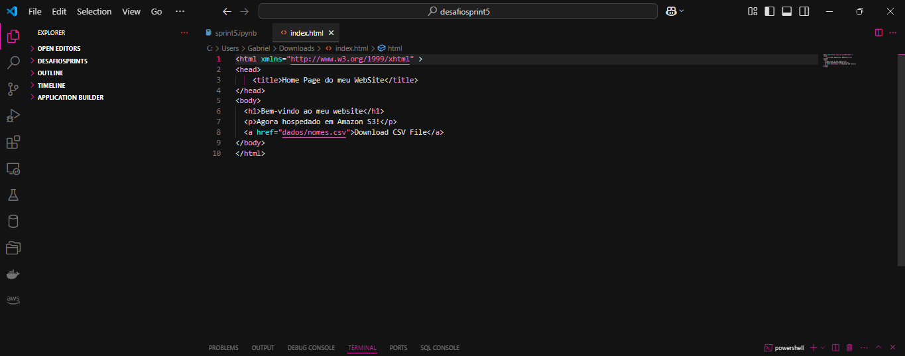
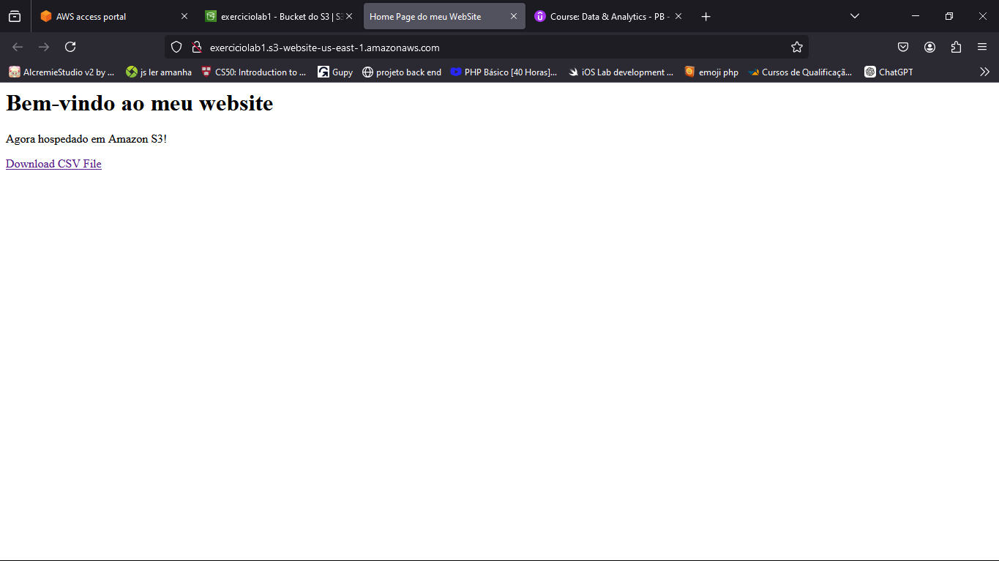
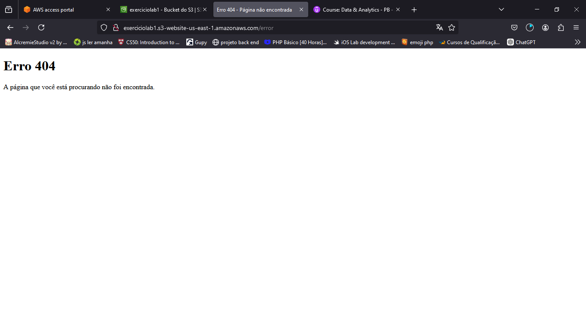

# Exercicio Lab S3 

### Objetivo do exercicio

Tinhamos como objetivo nesse exercicio configurar e gerenciar a hospedagem de um site estático no S3. Abaixo, iremos criar, configurar o bucket, habilitar a hospedagem estática, gerenciar permissão de acesso público e as politicas do bucket. 


## 1.0 Criando o Bucket

Bom, a principio, eu entrei pelo link que nos foi disponibilizado no console da amazon e busquei pelo serviço `S3`, cliquei em criar bucket e o nomeei de `"exerciciolab1"`, selecionei a região `us-east-1` e aceitei as configurações padrões como o solicitado. O bucket ficou como mostrado abaixo.


## 2.0 Habilitando a Hospedagem de Site Estático

Na aba onde mostra os buckets que eu mostrei acima cliquei no *exerciciolab1* e após isso cliquei em *propriedades* e desci a página até `"Hospedahem de site estático"` e cliquei em editar e ai somos jogado pra página abaixo.


Nesta parte ela vem com a hospedagem desativada por padrão, então eu a ativei. No documento de indice eu inseri o `index.html` e inseri em documento de erro o arquivo `404.html` que criei. E ficou assim.


Após isso salvei as alterações feitas e copiei o endpoint da página que fica ao fim da parte de hospedagem.


*obs*: Informamos esse endereço na barra de navegação do navegador para testar o resultado

## 3.0  Configurando o Bloqueio de Acesso Público

Ai dentro do bucket clicamos em `Permissões` e vamos em `Bloquear acesso público` (abaixo ja tá desativado pois já realizei essa etapa mas ele vem ativado por padrão)


Então, para deixar desativado, clicamos no botão editar e depois desmarcamos *"Bloquear todo acesso público"* e depois salvamos as alterações.


## 4.0 Adicionando as políticas do Bucket para tornar o Conteúdo Público

Descendo a página que estamos ainda em permissões vamos editar a `política do bucket` clicando no botão editar e depois copiando a política que vocês nos disponibilizaram.

``` json
    {
        "Version": "2012-10-17",
        "Statement": [
            {
                "Sid": "PublicReadGetObject",
                "Effect": "Allow",
                "Principal": "*",
                "Action": [
                    "s3:GetObject"
                ],
                "Resource": [
                    "arn:aws:s3:::exerciciolab1*"
                ]
            }
        ]
    }
```

E após inserirmos, clicamos em salvar alterações e ele vai ficar assim.


## 5.0 Configurando o documento de indice, de erro e criando diretorio dados 

Bom, nessa parte vocês nos disponibilizam um arquivo *index.html* então realizamos o download dele. O código presente nele vou deixar abaixo. 



e pro documento de error vocês pedem para que façamos o código em html e o nomeamos como *"404.html"* o meu código ficou assim.


Bom na parte dos bucket vou deixar a imagem abaixo, a minha ja está com os arquivos e o diretorio dados inseridos porque já realizei o exercicio, mas quando clicarmos no bucket vai estar vazio. O que iremos fazer é clicar em carregar ali em cima como você pode observar na imagem abaixo.


e ele vai nos jogar pra seguinte página


Aqui nós vamos clicar em `adicionar arquivos` selecionar o arquivo que nos queremos no caso `"index.html"` e iremos salva-lo clicando em carregar após isso faremos o mesmo com o de error `"404.html"`.

<p>

Após isso iremos criar um diretorio chamado dados, para por o arquivo `.csv` que nós é disponibilizado. Para isso clicamos em Criar pasta e vai ser aberta a seguinte página onde iremos inserir o nome dela e após clicaremos em criar pasta lá embaixo.


Após isso nosso bucket ficará como podemos ver lá em cima com uma pasta chamada dados agora. Dentro dessa pasta iremos fazer a mesma coisa que fizemos pra carregar os arquivos `index.html` e `404.html`.

Após isso a pasta ficará assim


## 6.0 testando o endpoint do site

Bom aqui iremos copiar o endpoint que fica no final da parte de hospedagem como fizemos na `etapa 2.0` e colaremos na aba de pesquisa do nosso navegador se executarmos todos os passos corretamente obteremos os seguintes resultados:


#### Página index.html



##### Realizando Download do .csv ao clicar no botão


#### Página de error 404.html

