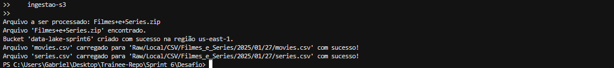
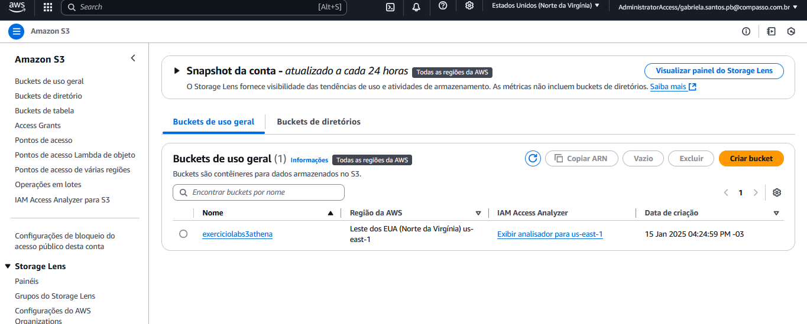
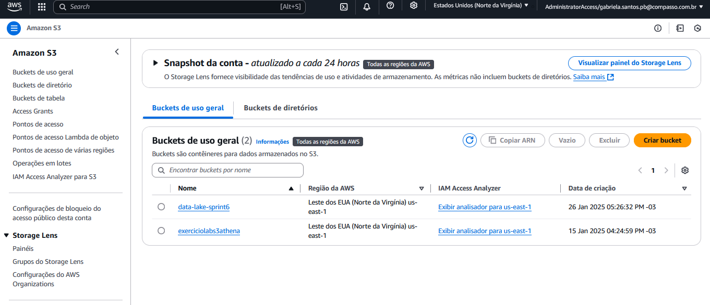
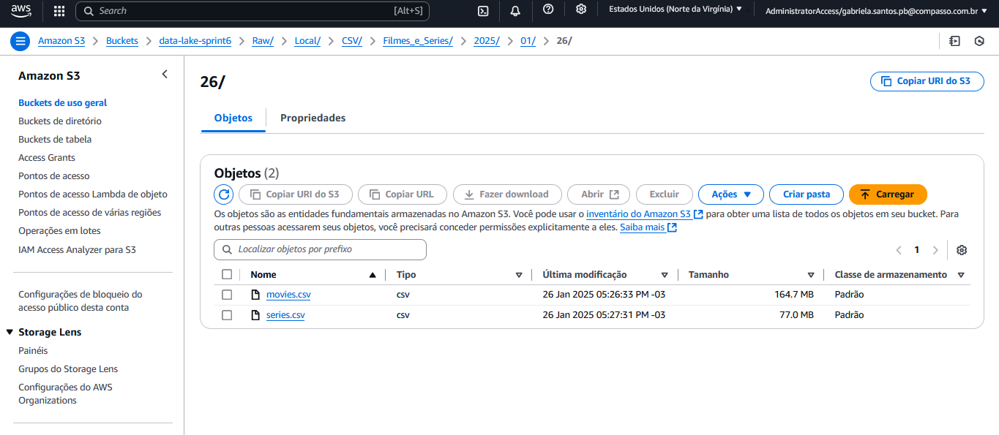

# Sobre

Nosso objetivo foi aplicar os conhecimentos adquiridos sobre AWS, Python e Docker. Trabalhamos com um arquivo ZIP contendo arquivos CSV, onde realizamos a ingestão dos dados diretamente para um bucket no AWS S3 através de um script Python executado dentro de um container Docker.

# Instruções: Como foi realizado o desafio

#### Antes de começar a explicar o código, precisamos realizar algumas configurações:

- **Bibliotecas usadas**: `boto3`, `zipfile`, `os`, `datetime` e `botocore` (dependência do `boto3`).
- **Instalações necessárias**: Biblioteca `boto3`, Python, Docker e AWS CLI.
- **Extensões úteis**: AWS Toolkit para VSCode (facilita a integração e visualização de recursos AWS).

Código usado no terminal para instalação das bibliotecas:

```bash
pip install boto3
```

*OBS*: O Arquivo filmes e series .zip nos é disponibilizado no desafio e por ser muito grande mesmo zipado nos foi recomendado apenas alertar onde baixa-lo para executar o desafio ao invés de uparmos ele no github.

### Configuração do AWS CLI

A configuração do AWS CLI foi detalhada na Sprint anterior. Para configurar o acesso à AWS, siga as instruções fornecidas no README da Sprint 5. Certifique-se de que o AWS CLI está configurado corretamente e que você está autenticado usando o comando:
bash
Copy

``` bash
aws sso login
```

### Criando o Bucket e Carregando os Arquivos CSV para o S3

O script `desafio.py` realiza a criação de um bucket no S3 (se ele não existir) e faz o upload dos arquivos CSV contidos em um arquivo ZIP para o bucket.

#### Configuração do cliente S3

```python

import os
import zipfile
import boto3
from datetime import datetime
from botocore.exceptions import ClientError

s3 = boto3.client('s3')
NOME_BUCKET = "data-lake-sprint6"
REGIAO = "us-east-1"
CAMINHO_RAW = "Raw/Local/CSV"
```

#### Função para criar o bucket

A função `criar_bucket` verifica se o bucket já existe. Caso não exista, ele cria o bucket na região especificada.

``` python

def criar_bucket(nome_bucket, regiao="us-east-1"):
    try:
        resposta = s3.list_buckets()
        buckets_existentes = [bucket['Name'] for bucket in resposta.get("Buckets", [])]

        if nome_bucket in buckets_existentes:
            print(f"O bucket '{nome_bucket}' já existe.")
        else:
            if regiao == "us-east-1":
                s3.create_bucket(Bucket=nome_bucket)
            else:
                s3.create_bucket(
                    Bucket=nome_bucket,
                    CreateBucketConfiguration={"LocationConstraint": regiao},
                )
            print(f"Bucket '{nome_bucket}' criado com sucesso na região {regiao}.")
    except ClientError as e:
        print(f"Erro ao criar/verificar o bucket: {e}")
```
#### Função para enviar arquivos para o S3

A função `enviar_para_s3` extrai os arquivos CSV do ZIP e os envia para o S3, seguindo o padrão de caminho: *Raw/Local/CSV/<tipo_arquivo>/<ano>/<mês>/<dia>/<arquivo.csv>*

```python

def enviar_para_s3(arquivo_zip, tipo_arquivo):
    try:
        agora = datetime.now()
        ano = agora.strftime("%Y")
        mes = agora.strftime("%m")
        dia = agora.strftime("%d")

        with zipfile.ZipFile(arquivo_zip, 'r') as zip_ref:
            arquivos_csv = [f for f in zip_ref.namelist() if f.endswith('.csv')]
            if not arquivos_csv:
                print("Nenhum arquivo CSV encontrado dentro do ZIP!")
                return

            for arquivo in arquivos_csv:
                with zip_ref.open(arquivo) as file:
                    chave_s3 = f"{CAMINHO_RAW}/{tipo_arquivo}/{ano}/{mes}/{dia}/{os.path.basename(arquivo)}"
                    s3.upload_fileobj(file, NOME_BUCKET, chave_s3)
                    print(f"Arquivo '{arquivo}' carregado para '{chave_s3}' com sucesso!")
    except Exception as e:
        print(f"Erro ao enviar arquivos do ZIP para o S3: {e}")
```

### Executando o script principal

O script principal verifica se o arquivo ZIP existe, cria o bucket e envia os arquivos CSV para o S3.

```python

def main():
    caminho_zip = "Filmes+e+Series.zip"
    print(f"Arquivo a ser processado: {caminho_zip}")

    if os.path.exists(caminho_zip):
        print(f"Arquivo '{caminho_zip}' encontrado.")
    else:
        print(f"Arquivo '{caminho_zip}' não encontrado!")
        return

    criar_bucket(NOME_BUCKET, REGIAO)
    enviar_para_s3(caminho_zip, "Filmes_e_Series")

if __name__ == "__main__":
    main()
```

## Executando o Script em um Container Docker

Para garantir que o script seja executado em um ambiente consistente, utilizamos um container Docker. O Dockerfile abaixo configura o ambiente e executa o script.

#### Dockerfile

``` Dockerfile
# Usando uma imagem oficial do Python como base
FROM python:3.9-slim

# Instalamdo boto3
RUN pip install boto3

# Configurando o diretório de trabalho dentro do container
WORKDIR /app

# Copiando todos os arquivos do diretório local para o container
COPY . /app

# Comando padrão para executar o script
CMD ["python", "desafio.py"]
```

## Executando o container com volume e credenciais da AWS

Para executar o container, utilizei o seguinte comando, substituindo as credenciais da AWS pelas suas:

``` Dockerfile
docker run --rm \
  -v "$(Get-Location)\Filmes+e+Series.zip:/app/Filmes+e+Series.zip" \
  -e AWS_ACCESS_KEY_ID="SUA_CHAVE_AQUI" \
  -e AWS_SECRET_ACCESS_KEY="SUA_CHAVE_SECRETA_AQUI" \
  -e AWS_SESSION_TOKEN="SEU_TOKEN_AQUI" \
  ingestao-s3
```

resultado pos executar:



*obs*: Certifique-se de substituir as variáveis de credenciais `(AWS_ACCESS_KEY_ID, AWS_SECRET_ACCESS_KEY, AWS_SESSION_TOKEN)` pelas suas credenciais da AWS.

# Resultado

### Bucket no S3 

#### antes da execução:


#### depois da execução:


#### Arquivos CSV Carregados no S3:




# Perguntas Selecionadas

### 1 Qual é a média de artistas femininas em séries de comédia?

Eu pensei nessa pergunta porque ela ajuda a entender a representatividade das mulheres no gênero. Saber quantas artistas femininas estão envolvidas em séries de comédia pode revelar se há equilíbrio de gênero ou se ainda existe uma disparidade que precisa ser discutida.

### 2 Quais artistas femininas têm mais destaque em séries de comédia?

Já aqui, o foco é reconhecer as artistas mulheres que se destacaram no gênero, seja como atrizes, roteiristas, diretoras ou produtoras. Isso valoriza o trabalho delas e pode inspirar mais inclusão e oportunidades para artistas femininas.

### 3 Como a participação de artistas femininas em séries de comédia evoluiu ao longo dos anos?

Essa pergunta analisa a trajetória da representatividade feminina no gênero. Verificar se houve um aumento ou diminuição na participação de mulheres ao longo do tempo pode indicar tendências e mudanças na indústria.

### Quais animações com protagonistas femininas tiveram maior sucesso?

Bom, o foco é identificar produções animadas lideradas por personagens femininas que foram bem recebidas pelo público e pela crítica. Isso pode mostrar o potencial de histórias centradas em mulheres e inspirar mais produções nesse sentido.

### Quais séries de animação com artistas femininas têm as maiores notas médias?

Essa pergunta foca na representatividade feminina, destacando as produções de maior qualidade que contaram com a participação de mulheres