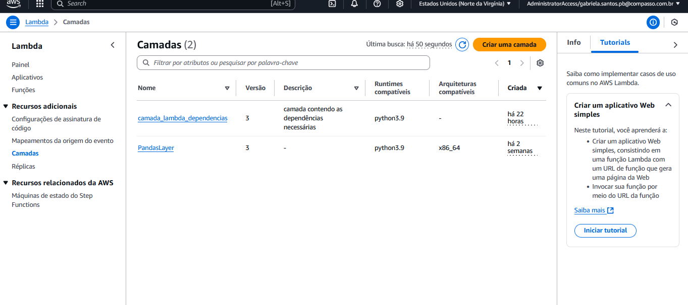
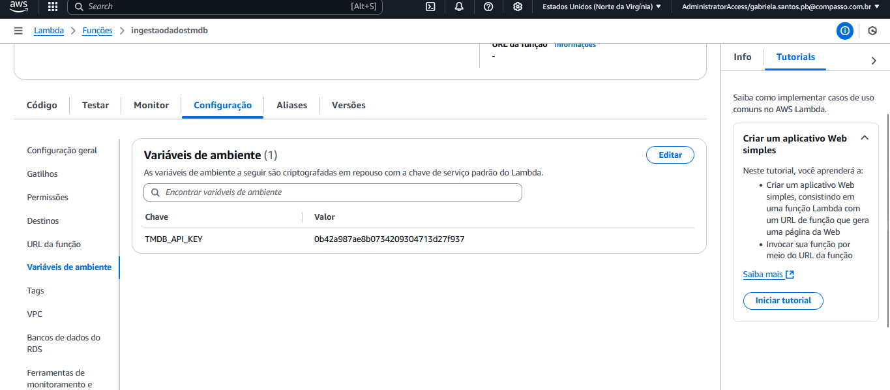
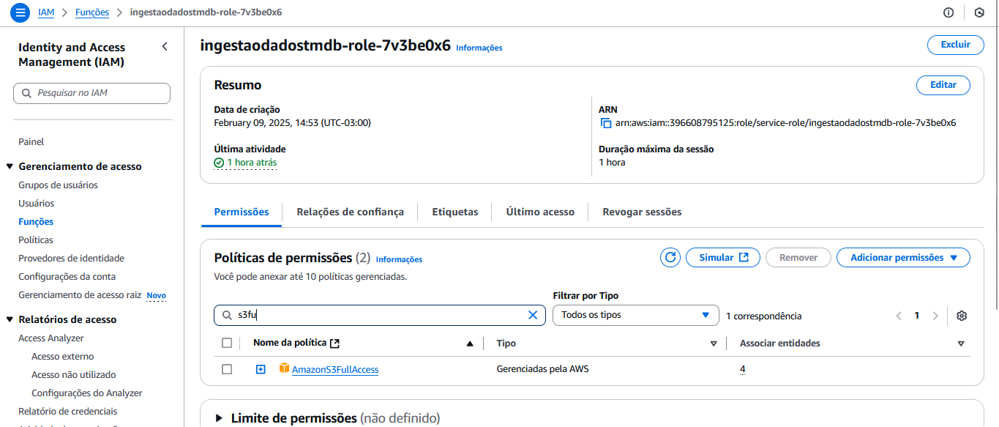
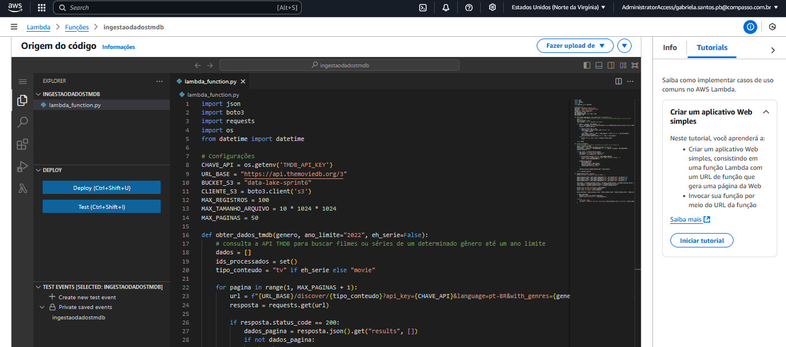
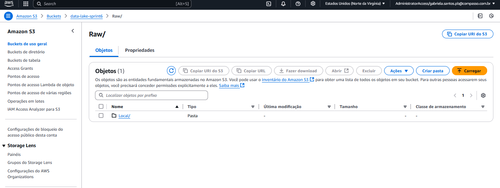
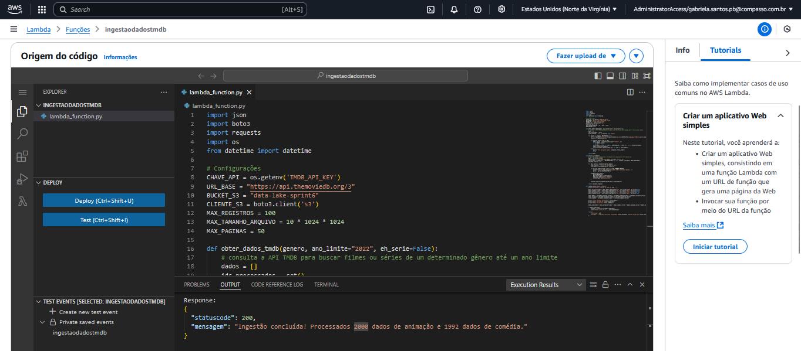
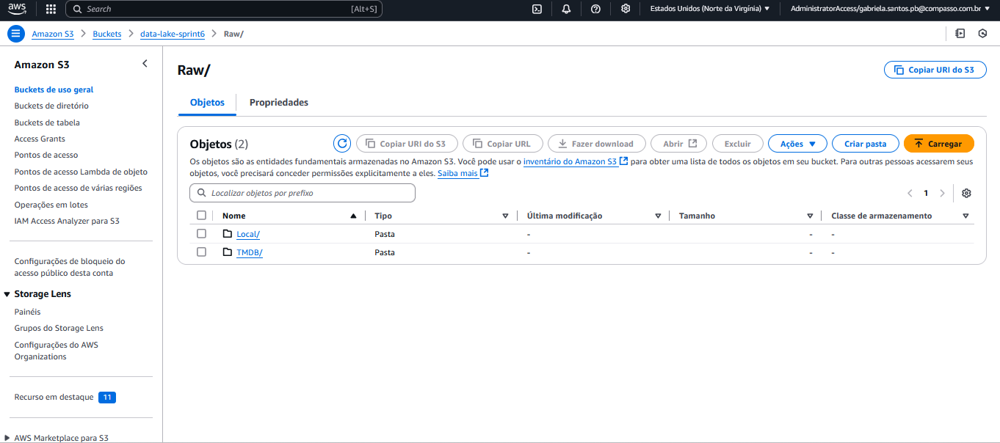
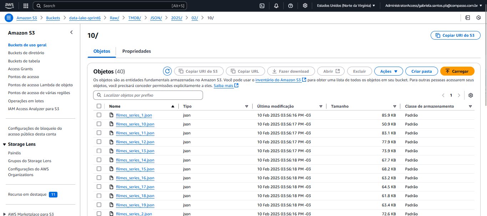
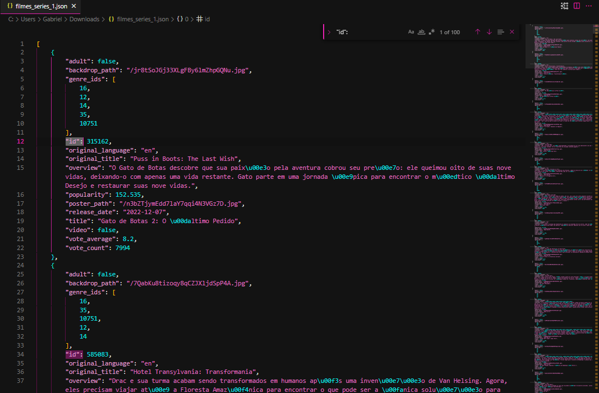

# Sobre

Nosso objetivo foi aplicar os conhecimentos adquiridos sobre AWS, Python e etc na ingestão de dados via API. Trabalhamos com a API TMDB para coletar informações sobre filmes e séries, realizando a ingestão dos dados diretamente para um bucket no AWS S3 através de uma função AWS Lambda escrita em Python.

# Instruções: Como foi realizado o desafio

#### Antes de começar a explicar o código, precisamos realizar algumas configurações:

- **Bibliotecas usadas**: `boto3`, `requests`, `json`, `os`, `datetime` e `botocore` (dependência do `boto3`).


Essa parte das bibliotecas tivemos de realizar as instalações delas localmente, eu as coloquei dentro de um dir `python`e as compactei como  *camada_lamda.zip* e após isso dentro do lambda na parte de camadas criei a camada *camada_lambda_dependencias* e realizei o upload do arquivo *.zip*. 

#### A "camada_lambda_dependencias" dentro das camadas no lambda.


Código usado no terminal para criação dos diretorios, instalação das bibliotecas e compactação pra zip:

``` powershell
mkdir camada_lambda_dependencias
cd camada_lambda_dependencias
mkdir python
pip install requests -t python/
pip install boto3 -t python/

Compress-Archive -Path python -DestinationPath C:\Users\Gabriel\camada_lambda_dependencias.zip
```

### Criando variável de ambiente pra chave API

*OBS*: A API TMDB exige uma chave de acesso. Ela deve ser armazenada de forma segura e não deve ser exposta no código-fonte. Para realizar isso, eu fui nas configurações e coloque a chave api nas variáveis de ambiente. Imagem abaixo do local onde colocamos a chave api.




#### Configuração do cliente S3

```python
import os
import json
import boto3
import requests
from datetime import datetime
from botocore.exceptions import ClientError

s3 = boto3.client('s3')
NOME_BUCKET = "data-lake-sprint6"
REGIAO = "us-east-1"
CAMINHO_RAW = "Raw/TMDB/JSON"
API_KEY = os.getenv("TMDB_API_KEY")  
```

*OBS*: Utilizei o bucket da Sprint passada

<p>

### Função para buscar dados da API TMDB

A função `buscar_dados_tmdb` coleta informações de filmes e séries e os agrupa em arquivos JSON de até 100 registros.

```python
def buscar_dados_tmdb(endpoint, params={}):
    url = f"https://api.themoviedb.org/3/{endpoint}"
    params["api_key"] = API_KEY
    response = requests.get(url, params=params)
    if response.status_code == 200:
        return response.json()
    else:
        print(f"Erro na requisição: {response.status_code}")
        return None
```


### Salvando os Dados no raw do bucket da S3

A função AWS Lambda consome dados da API TMDB, divide os registros em grupos de até 100 entradas e salva os arquivos JSON na camada RAW do bucket S3.

```python
def salvar_no_s3(dados, tipo_dado):
    try:
        agora = datetime.now()
        ano = agora.strftime("%Y")
        mes = agora.strftime("%m")
        dia = agora.strftime("%d")
        chave_s3 = f"{CAMINHO_RAW}/{tipo_dado}/{ano}/{mes}/{dia}/dados.json"
        s3.put_object(Bucket=NOME_BUCKET, Key=chave_s3, Body=json.dumps(dados))
        print(f"Dados salvos em {chave_s3}")
    except ClientError as e:
        print(f"Erro ao salvar dados no S3: {e}")
```

### Implementando a Função AWS Lambda

A função Lambda busca dados de filmes populares e séries de TV do TMDB e os salva no S3.

```python
def lambda_handler(event, context):
    filmes = buscar_dados_tmdb("movie/popular")
    series = buscar_dados_tmdb("tv/popular")
    
    if filmes:
        salvar_no_s3(filmes["results"], "Filmes")
    if series:
        salvar_no_s3(series["results"], "Series")

    return {
        "statusCode": 200,
        "body": "Ingestão concluída com sucesso!"
    }
```

### Dando permissão no IAM pra função

Para conceder permissão total ao S3 para minha função Lambda *ingestaodadostmdb*, acessei o AWS IAM, fui até a seção Funções e encontrei a função ingestaodadostmdb. Em seguida, entrei na aba Permissões, cliquei em Anexar políticas, busquei por `AmazonS3FullAccess` e selecionei essa política. Por fim, cliquei em Anexar política para finalizar o processo

Resultado da ingestão com a politica no IAM.





# Resultado

### Código no lambda

Coloquei metade do codigo pois foi o que coube na print mas é o código presente em `funcaolambda.py`



### Bucket no S3

#### Antes da execução:



#### Lambda mostrando que o codigo foi executado com sucesso no log



#### Depois da execução:


#### *Atenção* ao caminho que se encontra no pedido ao desafio e a imagem abaixo mostra os Arquivos JSON carregados no S3




### Arquivo json gerado. usei ctrl+f e pesquisei pelo "id": pra ter certeza que tinham 100 registros 

