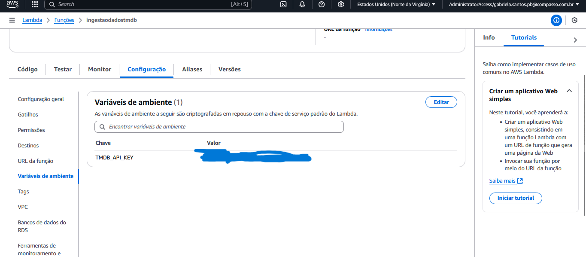

# Sobre

Nosso objetivo foi aplicar os conhecimentos adquiridos sobre AWS, Python e etc na ingestão de dados via API. Trabalhamos com a API TMDB para coletar informações sobre filmes e séries, realizando a ingestão dos dados diretamente para um bucket no AWS S3 através de uma função AWS Lambda escrita em Python.

# Instruções: Como foi realizado o desafio

#### Antes de começar a explicar o código, precisamos realizar algumas configurações(já com a função criada na parte de funções do lambda) :

- **Bibliotecas usadas**: `boto3`, `requests`, `json`, `os`, `datetime` e `botocore` (dependência do `boto3`).

Essa parte das bibliotecas tivemos de realizar as instalações delas localmente, eu as coloquei dentro de um dir `python` e as compactei como *camada_lamda_dependencias.zip* e após isso dentro do lambda na parte de camadas criei a camada *camada_lambda_dependencias* e realizei o upload do arquivo *.zip*.

#### A "camada_lambda_dependencias" dentro das camadas no lambda.


Código usado no terminal para criação dos diretórios, instalação das bibliotecas e compactação para zip:

``` powershell
mkdir camada_lambda_dependencias
cd camada_lambda_dependencias
mkdir python
pip install requests -t python/
pip install boto3 -t python/

Compress-Archive -Path python -DestinationPath C:\Users\Gabriel\camada_lambda_dependencias.zip
```

### Dando permissão no IAM pra função

Para conceder permissão total ao S3 para minha função Lambda *ingestaodadostmdb*, acessei o AWS IAM, fui até a seção Funções e encontrei a função ingestaodadostmdb. Em seguida, entrei na aba Permissões, cliquei em Anexar políticas, busquei por `AmazonS3FullAccess` e selecionei essa política. Por fim, cliquei em Anexar política para finalizar o processo


### Criando variável de ambiente para a chave API

*OBS*: A API TMDB exige uma chave de acesso. Ela deve ser armazenada de forma segura e não deve ser exposta no código-fonte. Para realizar isso, eu fui nas configurações e coloquei a chave API nas variáveis de ambiente. Imagem abaixo do local onde colocamos a chave API.



#### Configuração do cliente S3

```python
import json
import boto3
import requests
import os
from datetime import datetime

# Configurações
CHAVE_API = os.getenv('TMDB_API_KEY')
URL_BASE = "https://api.themoviedb.org/3"
BUCKET_S3 = "data-lake-sprint6"  
CLIENTE_S3 = boto3.client('s3')
MAX_REGISTROS = 100  
MAX_TAMANHO_ARQUIVO = 10 * 1024 * 1024  
MAX_PAGINAS = 50
```

*OBS*: Utilizei o bucket da Sprint passada

### Função para buscar dados da API TMDB

A função `obter_dados_tmdb` busca dados apenas dos gêneros "Comédia" e "Animação", tanto para filmes quanto para séries.

```python
def obter_dados_tmdb(genero, ano_limite="2022", eh_serie=False):
    # consulta a API TMDB para buscar filmes ou séries de um determinado gênero até um ano limite
    dados = []
    ids_processados = set()
    tipo_conteudo = "tv" if eh_serie else "movie"

    for pagina in range(1, MAX_PAGINAS + 1):
        url = f"{URL_BASE}/discover/{tipo_conteudo}?api_key={CHAVE_API}&language=pt-BR&with_genres={genero}&page={pagina}&sort_by=popularity.desc&primary_release_year={ano_limite}"
        resposta = requests.get(url)
        
        if resposta.status_code == 200:
            dados_pagina = resposta.json().get("results", [])
            if not dados_pagina:
                break
            novos_dados = [item for item in dados_pagina if item['id'] not in ids_processados]
            dados.extend(novos_dados)
            ids_processados.update([item['id'] for item in novos_dados])
        else:
            print(f"Erro ao buscar dados: {resposta.status_code}")
            break
    
    return dados
```

### Salvando os Dados no raw do bucket da S3

A função AWS Lambda consome dados da API TMDB, divide os registros em grupos de até 100 entradas e salva os arquivos JSON na camada RAW do bucket S3.

```python
def salvar_no_s3(dados):
    # salva os dados no Amazon S3, dividindo-os em arquivos se for necessário
    agora = datetime.utcnow()
    caminho_base = f"Raw/TMDB/JSON/{agora.strftime('%Y/%m/%d')}/"
    partes_dados = [dados[i:i + MAX_REGISTROS] for i in range(0, len(dados), MAX_REGISTROS)]
    caminhos_arquivos = []
    
    for idx, parte in enumerate(partes_dados):
        nome_arquivo = f"filmes_series_{idx+1}.json"
        json_dados = json.dumps(parte, indent=4)
        
        if len(json_dados.encode('utf-8')) > MAX_TAMANHO_ARQUIVO:
            print(f"Arquivo {nome_arquivo} excedeu 10MB, ajustando tamanho...")
            parte = parte[:MAX_REGISTROS-1]
        
        CLIENTE_S3.put_object(
            Bucket=BUCKET_S3,
            Key=caminho_base + nome_arquivo,
            Body=json.dumps(parte, indent=4),
            ContentType="application/json"
        )
        
        caminhos_arquivos.append(caminho_base + nome_arquivo)
    
    return caminhos_arquivos
```

### Implementando a Função AWS Lambda

 A função Lambda faz a ingestão de dados dos gêneros "Comédia" e "Animação" do TMDB e os armazena no S3.

```python
def lambda_handler(event, context):
    print("Iniciando a ingestão de dados da TMDB...")
    
    dados_animacao_filmes = obter_dados_tmdb(genero="16", ano_limite="2022", eh_serie=False)
    dados_comedia_filmes = obter_dados_tmdb(genero="35", ano_limite="2022", eh_serie=False)
    dados_animacao_series = obter_dados_tmdb(genero="16", ano_limite="2022", eh_serie=True)
    dados_comedia_series = obter_dados_tmdb(genero="35", ano_limite="2022", eh_serie=True)
    
    total_dados = len(dados_animacao_filmes) + len(dados_comedia_filmes) + len(dados_animacao_series) + len(dados_comedia_series)
    total_animacao = len(dados_animacao_filmes) + len(dados_animacao_series)
    total_comedia = len(dados_comedia_filmes) + len(dados_comedia_series)
    
    print(f"Total de dados processados: {total_dados}")
    print(f"Dados de animação: {total_animacao}")
    print(f"Dados de comédia: {total_comedia}")
    
    dados_combinados = dados_animacao_filmes + dados_comedia_filmes + dados_animacao_series + dados_comedia_series
    
    if dados_combinados:
        caminhos = salvar_no_s3(dados_combinados)
        print(f"Dados salvos em: {', '.join(caminhos)}")
    
    return {
        "statusCode": 200,
        "mensagem": f"Ingestão concluída! Processados {total_animacao} dados de animação e {total_comedia} dados de comédia."
    }
```

### Resultado

#### Antes da execução:


#### Lambda mostrando que o código foi executado com sucesso no log


#### Depois da execução:


#### Arquivo JSON gerado:


# Perguntas Selecionadas

obs: vou acabar repetindo essa parte das perguntas que irei utilizar pois ja havia botado na sprint passada. 

### 1 Qual é a média de artistas femininas em séries de comédia?

Eu pensei nessa pergunta porque ela ajuda a entender a representatividade das mulheres no gênero. Saber quantas artistas femininas estão envolvidas em séries de comédia pode revelar se há equilíbrio de gênero ou se ainda existe uma disparidade que precisa ser discutida.

### 2 Quais artistas femininas têm mais destaque em séries de comédia?

Já aqui, o foco é reconhecer as artistas mulheres que se destacaram no gênero, seja como atrizes, roteiristas, diretoras ou produtoras. Isso valoriza o trabalho delas e pode inspirar mais inclusão e oportunidades para artistas femininas.

### 3 Como a participação de artistas femininas em séries de comédia evoluiu ao longo dos anos?

Essa pergunta analisa a trajetória da representatividade feminina no gênero. Verificar se houve um aumento ou diminuição na participação de mulheres ao longo do tempo pode indicar tendências e mudanças na indústria.

### 4 Quais animações com protagonistas femininas tiveram maior sucesso?

Bom, o foco é identificar produções animadas lideradas por personagens femininas que foram bem recebidas pelo público e pela crítica. Isso pode mostrar o potencial de histórias centradas em mulheres e inspirar mais produções nesse sentido.

### 5 Quais séries de animação com artistas femininas têm as maiores notas médias?

Essa pergunta foca na representatividade feminina, destacando as produções de maior qualidade que contaram com a participação de mulheres