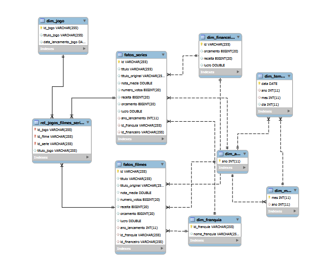
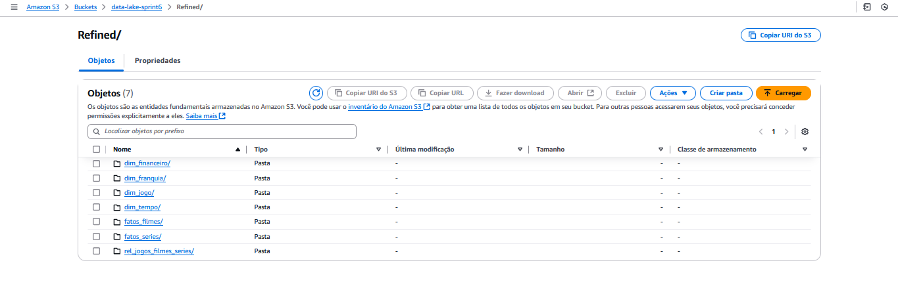

# Sobre

O objetivo deste projeto foi implementar a camada Refined no Data Lake, utilizando AWS Glue para processar dados da camada Trusted e transformá-los em um formato adequado para análise e extração de insights. A camada Refined segue os princípios de modelagem multidimensional, permitindo análises sobre diferentes perspectivas.

# Instruções: Como foi realizado o desafio

# Perguntas Selecionadas para Análise

O foco da análise foi a franquia Pokémon, com o objetivo de entender sua evolução ao longo do tempo, considerando popularidade, lucratividade e comparação com outras franquias. As principais perguntas que guiaram a análise foram:

- Como a avaliação dos filmes e séries de Pokémon mudou ao longo do tempo?

- Quais anos tiveram os maiores picos de popularidade para filmes e séries de Pokémon?

- Existe correlação entre lançamentos de jogos Pokémon e o aumento do interesse nos filmes/séries?

- Como a quantidade de lançamentos de filmes e séries mudou com o tempo?

- Como a receita dos filmes Pokémon evoluiu até 2022?

- Comparando com outras animações (Digimon, Dragon Ball, One Piece etc.), Pokémon foi mais ou menos lucrativo?

- Existe relação entre a bilheteria dos filmes Pokémon e os períodos de maior venda dos jogos?

- Qual foi o impacto do lançamento de Pokémon GO (2016) na popularidade dos filmes e séries?

- Como a pandemia de COVID-19 impactou os lançamentos e a popularidade da franquia?

# Modelagem de Dados

A modelagem de dados foi realizada seguindo os princípios de modelagem multidimensional, com a criação de tabelas e views no AWS Glue Data Catalog. A origem dos dados foi a camada Trusted, e os dados foram transformados e armazenados na camada Refined no formato Parquet, particionados conforme necessário.
Diagrama da Modelagem de Dados

### Aqui está um diagrama que ilustra a estrutura da camada Refined:




# Job 2: Processamento de Dados JSON para Camada Trusted

Este job é responsável por transformar os dados de filmes, séries e jogos que foram salvos na camada Trusted e organizá-los na camada Refined, aplicando processos de limpeza, integração e criação de tabelas de fato e dimensão para facilitar consultas e análises.

### Código 

```python
import sys
from pyspark.sql import SparkSession
from pyspark.sql.functions import col, expr, udf, concat_ws
from pyspark.sql.types import ArrayType, StringType, DoubleType

# Criando a SparkSession
spark = SparkSession.builder.appName("GlueJob_Refined").getOrCreate()

# Caminho dos dados da Trusted Zone
trusted_filmes_path = "s3://data-lake-sprint6/Trusted/Local/Parquet/Filmes/"
trusted_series_path = "s3://data-lake-sprint6/Trusted/Local/Parquet/Series/"
trusted_movies_path = "s3://data-lake-sprint6/Trusted/TMDB/Parquet/Movies/ano_ingestao=2025/mes_ingestao=2/dia_ingestao=23/"
trusted_tmdb_series_path = "s3://data-lake-sprint6/Trusted/TMDB/Parquet/Series/ano_ingestao=2025/mes_ingestao=2/dia_ingestao=23/"
trusted_games_path = "s3://data-lake-sprint6/Trusted/IGDB/Parquet/Games/"

# Caminho da Refined Zone
refined_filmes_path = "s3://data-lake-sprint6/Refined/fatos_filmes/"
refined_series_path = "s3://data-lake-sprint6/Refined/fatos_series/"
refined_dim_franquia_path = "s3://data-lake-sprint6/Refined/dim_franquia/"
refined_dim_jogo_path = "s3://data-lake-sprint6/Refined/dim_jogo/"
refined_dim_tempo_path = "s3://data-lake-sprint6/Refined/dim_tempo/"
refined_dim_financeiro_path = "s3://data-lake-sprint6/Refined/dim_financeiro/"
refined_relacionamento_path = "s3://data-lake-sprint6/Refined/rel_jogos_filmes_series/"

# Carregando dados da Trusted Zone
filmes_df = spark.read.parquet(trusted_filmes_path)
series_df = spark.read.parquet(trusted_series_path)
movies_df = spark.read.parquet(trusted_movies_path)
tmdb_series_df = spark.read.parquet(trusted_tmdb_series_path)
games_df = spark.read.parquet(trusted_games_path)

# Mapeamento de gêneros (exemplo: números para nomes)
generos_map = {
    28: "Action",
    12: "Adventure",
    16: "Animation",
    35: "Comedy",
    80: "Crime",
    99: "Documentary",
    18: "Drama",
    10751: "Family",
    14: "Fantasy",
    36: "History",
    27: "Horror",
    10402: "Music",
    9648: "Mystery",
    10749: "Romance",
    878: "Science Fiction",
    10770: "TV Movie",
    53: "Thriller",
    10752: "War",
    37: "Western",
}

# Função para mapear números de gêneros para nomes
def mapear_generos(generos_array):
    return [generos_map.get(genero, "Desconhecido") for genero in generos_array]

# Registrando a função como UDF
mapear_generos_udf = udf(mapear_generos, ArrayType(StringType()))

# Transformando a coluna 'generos' em movies_df e tmdb_series_df
movies_df = movies_df.withColumn("generos", mapear_generos_udf(col("generos")))
tmdb_series_df = tmdb_series_df.withColumn("generos", mapear_generos_udf(col("generos")))

# Transformando o array de gêneros em uma string separada por vírgulas
movies_df = movies_df.withColumn("generos", concat_ws(", ", col("generos")))
tmdb_series_df = tmdb_series_df.withColumn("generos", concat_ws(", ", col("generos")))

# Convertendo a coluna 'id' para string em movies_df e tmdb_series_df
movies_df = movies_df.withColumn("id", col("id").cast("string"))
tmdb_series_df = tmdb_series_df.withColumn("id", col("id").cast("string"))

# Convertendo a coluna 'nota_media' para double em filmes_df
filmes_df = filmes_df.withColumn("nota_media", col("nota_media").cast("double"))

# Convertendo a coluna 'numero_votos' para bigint em filmes_df
filmes_df = filmes_df.withColumn("numero_votos", col("numero_votos").cast("bigint"))

# Adicionando as colunas faltantes no filmes_df para que tenha a mesma estrutura que movies_df
for col_name in movies_df.columns:
    if col_name not in filmes_df.columns:
        filmes_df = filmes_df.withColumn(col_name, expr("null").cast("string"))

# Adicionando as colunas faltantes no movies_df para que tenha a mesma estrutura que filmes_df
for col_name in filmes_df.columns:
    if col_name not in movies_df.columns:
        movies_df = movies_df.withColumn(col_name, expr("null").cast("string"))

# Verificando se a coluna 'id' está presente no filmes_df após a união
if "id" not in filmes_df.columns:
    filmes_df = filmes_df.withColumn("id", expr("null").cast("string"))

# Unindo os datasets para filmes e séries
filmes_df = filmes_df.union(movies_df)

# Adicionando as colunas faltantes no series_df para que tenha a mesma estrutura que tmdb_series_df
for col_name in tmdb_series_df.columns:
    if col_name not in series_df.columns:
        series_df = series_df.withColumn(col_name, expr("null").cast("string"))

# Adicionando as colunas faltantes no tmdb_series_df para que tenha a mesma estrutura que series_df
for col_name in series_df.columns:
    if col_name not in tmdb_series_df.columns:
        tmdb_series_df = tmdb_series_df.withColumn(col_name, expr("null").cast("string"))

# Unindo os datasets para séries
series_df = series_df.union(tmdb_series_df)

# Removendo duplicatas (caso existam)
filmes_df = filmes_df.dropDuplicates()
series_df = series_df.dropDuplicates()

# Verificando se a coluna 'id' está presente no filmes_df após a união
if "id" not in filmes_df.columns:
    filmes_df = filmes_df.withColumn("id", expr("null").cast("string"))

# Criando Dimensão Tempo
dim_tempo_df = filmes_df.select(
    col("ano_lancamento").alias("ano"),
    expr("substring(data_lancamento, 6, 2)").alias("mes"),
    expr("substring(data_lancamento, 9, 2)").alias("dia"),
    col("data_lancamento").alias("data")
).distinct()

# Criando Dimensão Franquia
dim_franquia_df = filmes_df.select(
    col("id").alias("id_franquia"),
    col("titulo_principal").alias("nome_franquia")
).distinct()

# Criando Dimensão Jogo
dim_jogo_df = games_df.select(
    col("titulo").alias("id_jogo"),  
    col("titulo").alias("titulo_jogo"),  
    col("data_lancamento").alias("data_lancamento_jogo")  
).distinct()

# Criando Dimensão Financeiro
dim_financeiro_df = filmes_df.select(
    col("id").alias("id"),
    col("orcamento").cast("bigint"),
    col("receita").cast("bigint"),
    expr("receita - orcamento").alias("lucro")
).distinct()

# Transformações para a Fato Filmes
fatos_filmes_df = filmes_df.select(
    col("id").alias("id"),
    col("titulo_principal").alias("titulo"),
    col("titulo_original"),
    col("ano_lancamento").cast("int"),
    col("nota_media").cast("double"),
    col("numero_votos").cast("bigint"),
    col("receita").cast("bigint"),
    col("orcamento").cast("bigint"),
    expr("receita - orcamento").alias("lucro")
)

# Transformações para a Fato Séries
fatos_series_df = series_df.select(
    col("id").alias("id"),
    col("titulo_principal").alias("titulo"),
    col("titulo_original"),
    col("ano_lancamento").cast("int"),
    col("nota_media").cast("double"),
    col("numero_votos").cast("bigint"),
    col("receita").cast("bigint"),
    col("orcamento").cast("bigint"),
    expr("receita - orcamento").alias("lucro")
)

# Criando tabela de Relacionamento entre Jogos, Filmes e Séries
relacionamento_df = games_df.alias("g").join(filmes_df.alias("f"), expr("g.titulo = f.titulo"), "left")\
    .join(series_df.alias("s"), expr("g.titulo = s.titulo"), "left")\
    .select(
        col("g.titulo").alias("id_jogo"),  
        col("f.id").alias("id_filme"),
        col("s.id").alias("id_serie"),
        col("g.titulo").alias("titulo_jogo")
    )

# Salvando os dados na Refined Zone com particionamento
dim_tempo_df.write.mode("overwrite").partitionBy("ano", "mes", "dia").parquet(refined_dim_tempo_path)
dim_franquia_df.write.mode("overwrite").parquet(refined_dim_franquia_path)
dim_jogo_df.write.mode("overwrite").parquet(refined_dim_jogo_path)
dim_financeiro_df.write.mode("overwrite").parquet(refined_dim_financeiro_path)
fatos_filmes_df.write.mode("overwrite").partitionBy("ano_lancamento").parquet(refined_filmes_path)
fatos_series_df.write.mode("overwrite").partitionBy("ano_lancamento").parquet(refined_series_path)
relacionamento_df.write.mode("overwrite").partitionBy("titulo_jogo").parquet(refined_relacionamento_path)

print("Processamento concluído com sucesso!")
```


## Os dados são ingeridos dos seguintes diretórios do Amazon S3:

### Filmes Locais:

s3://data-lake-sprint6/Trusted/Local/Parquet/Filmes/

### Séries Locais:

s3://data-lake-sprint6/Trusted/Local/Parquet/Series/

### Filmes TMDB: 

s3://data-lake-sprint6/Trusted/TMDB/Parquet/Movies/ano_ingestao=2025/mes_ingestao=2/dia_ingestao=23/

### Séries TMDB: 

s3://data-lake-sprint6/Trusted/TMDB/Parquet/Series/ano_ingestao=2025/mes_ingestao=2/dia_ingestao=23/

### Jogos IGDB:

s3://data-lake-sprint6/Trusted/IGDB/Parquet/Games/


### Transformações e Processamento

Durante a execução do job, são aplicadas as seguintes transformações:

### 1. Padronização e Conversão de Dados

Conversão de id para string.

Conversão de nota_media e orcamento para tipos numéricos apropriados.

Mapeamento de IDs de gênero para nomes.

Adição de colunas ausentes para manter consistência entre fontes diferentes.

### Unificação de Dados

Filmes: Combinação dos datasets locais e do TMDB.

Séries: Integração dos dados locais e do TMDB.

### Criação de Dimensões

Dimensão Tempo (dim_tempo_df): Anos, meses, dias e datas completas.

Dimensão Franquia (dim_franquia_df): ID da franquia e nome.

Dimensão Jogo (dim_jogo_df): ID, título e data de lançamento.

Dimensão Financeira (dim_financeiro_df): Orçamento, receita e lucro.

### 4. Criação de Tabelas Fato

Fato Filmes (fatos_filmes_df): Dados essenciais sobre os filmes.

Fato Séries (fatos_series_df): Informações principais sobre séries.

### 5. Relacionamento Entre Dados

Criação de uma tabela de relacionamento entre jogos, filmes e séries.


### Saída: Dados na Refined Zone


Após o processamento, os dados são armazenados em formato Parquet nos seguintes diretórios do Amazon S3:

#### Fatos de Filmes:

s3://data-lake-sprint6/Refined/fatos_filmes/

#### Fatos de Séries:

s3://data-lake-sprint6/Refined/fatos_series/

#### Dimensão Franquia: 

s3://data-lake-sprint6/Refined/dim_franquia/

#### Dimensão Jogo: 

s3://data-lake-sprint6/Refined/dim_jogo/

#### Dimensão Tempo: 

s3://data-lake-sprint6/Refined/dim_tempo/

#### Dimensão Financeira: 

s3://data-lake-sprint6/Refined/dim_financeiro/

#### Relacionamentos: 

s3://data-lake-sprint6/Refined/rel_jogos_filmes_series/


