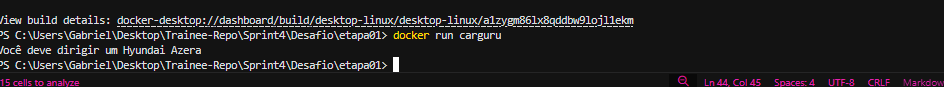
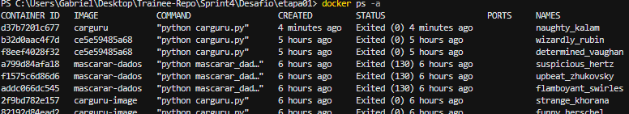
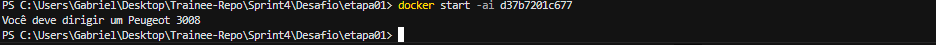
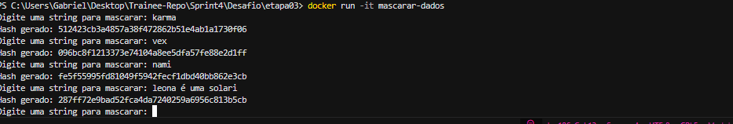
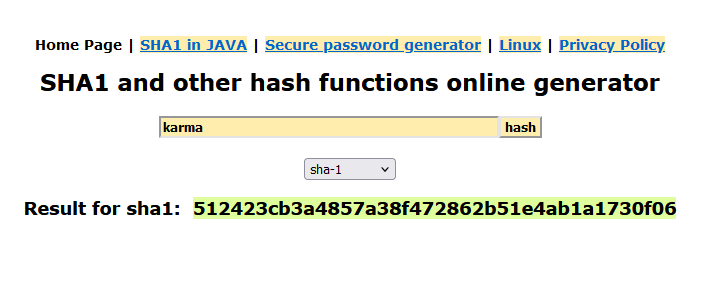

# Sobre

Bom, o objetivo deste desafio é utilizar o arquivo carguru.py como base para praticar conceitos de Python e Docker, dividindo as atividades em etapas que envolvem a construção de imagens Docker, manipulação de containers e criação de um script interativo. Durante o processo, são explorados conhecimentos de programação, configuração de ambientes isolados e execução de scripts que interagem com o usuário.


# Instruções, como foi realizado de fato o desafio.

#### Antes de eu começar a explicar o código em si precisamos realizar algumas coisas como:

- A instalação do Docker em nossa máquina.
- A instalação das Extensões Docker, Python e Markdown no VS Code.

### **1. Etapa 1: Criar uma imagem Docker para executar o arquivo carguru.py**

Primeiramente baixei o arquivo `carguru.py` e movi para a pasta *etapa01*, dentro dela criei o `'Dockerfile'` e dentro do arquivo inseri as instruções que ele deveria seguir:

```dockerfile

FROM python:3.9-slim

WORKDIR /app

COPY carguru.py .

CMD ["python", "carguru.py"]
```

<p>

Após isso, no terminal dentro do vscode eu usei o comando abaixo para criar a imagem.

``` bash
docker build -t carguru .
```

E para executar eu utilizei o seguinte comando.

``` bash
docker run carguru
```

obtive o seguinte resultado:



<p>

### **2. Etapa 2: Reutilização de Containers**
##### É possível?

Para essa etapa, verifiquei os containers parados usando este comando.

```bash
docker ps -a
```

resultado da verificação:




E reiniciei um dos containers parados com:

```bash
docker start -ai <iddocontainer>
```
(substituindo `<iddocontaainer>` pelo ID mostrado quando usamos o `"docker ps -a"`).

resultado:



Tendo em vista nossos resultados, sim, é totalmente possível reutilizar containers parados.

### **3. Etapa 3: Criação de Container Interativo para Mascaramento de Dados com Docker**

Primeiramente, eu criei o arquivo `mascarar_dados.py` e no caso tanto ele quanto o `Dockerfile` que criei estão dentro de uma pasta chamada `etapa03` para melhor organização. Enfim abaixo está o código que foi escrito dentro do arquivo.

```python
import hashlib

while True:
    entrada = input("Digite algo para mascarar: ")
    hash_obj = hashlib.sha1(entrada.encode())
    print(f"Hash gerado: {hash_obj.hexdigest()}")
```

Dentro do `Dockerfile` eu escrevi a seguinte instrução para ele seguir. 

```dockerfile
FROM python:3.9-slim
WORKDIR /app
COPY mascarar_dados.py .
CMD ["python", "mascarar_dados.py"]
```

Voltando pro terminal utilizei o comando abaixo para criar a imagem.

```bash
docker build -t mascarar-dados .
```

E logo após o executie usando seguinte comando.

```bash
docker run -it mascarar-dados
```

abaixo vou deixar o resultado dos hashes gerados no `terminal` e vou deixar o resultado de um deles que eu gerei no `SHA1 online` para apenas verificar que ele está gerando corretamente.

#### Terminal:



#### Online 

